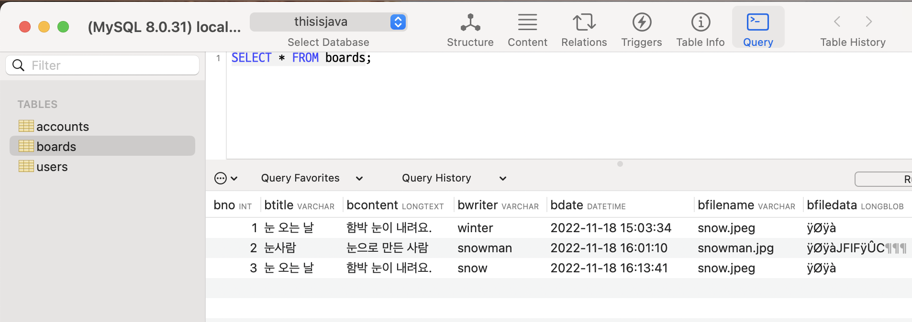
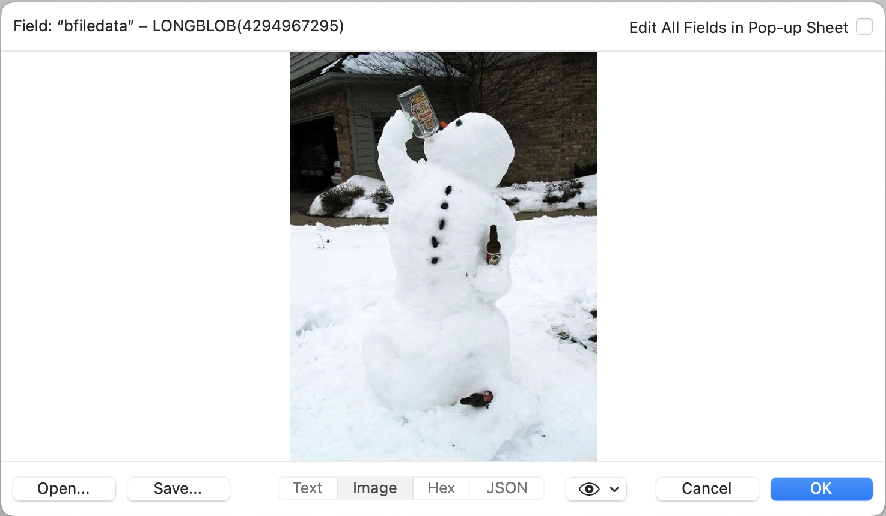
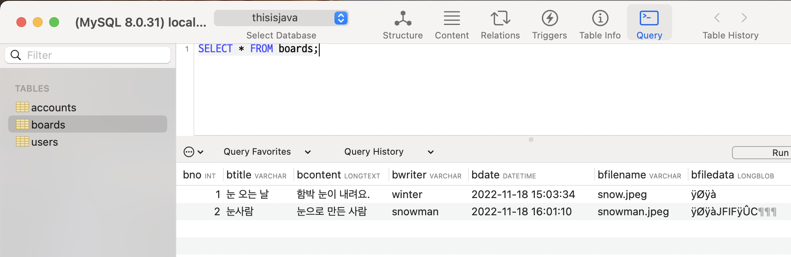
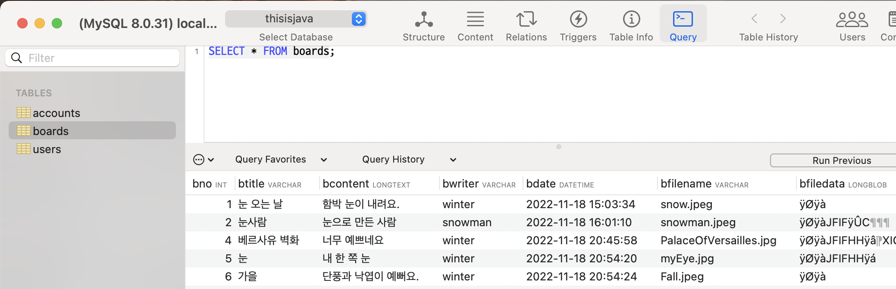
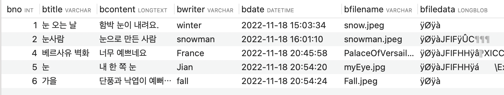
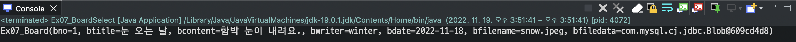

# ❤️‍🔥 **TIL DAY 09** ❤️‍🔥

> 📆 2022년 11월 18일 금요일

 

---

 

어제 새벽 4시 넘어서까지 못잤다...  
Java main class not Found Error 때문에..  
피곤해서 죽을거같애...  
원래 점심쯤이면 못잤어도 좀 쌩쌩해지는데...  
DB 부분 못따라가서 수업 내용도 못알아듣겠음..  
주말동안 Java랑 DB 부분 빡공해야함 ㅜㅜ 😭😭  

 

---

 

## 💡 JDBC

> DB 연결 작업을 할 수 있도록 Java에서 제공하는 라이브러리  
> JDBC: Java Database Connectivity

 

### ❓ DriverManager

- **JDBC Driver**를 관리
- DB와 연결해서 **`Connection` 구현 객체를 생성**

 

### ❓ Connection

- `Statement`, `PreparedStatement`, `CallableStatement` 구현객체 생성
- 트랜잭션 처리 및 DB 연결을 끊을 때 사용

 

### ❓ Statement

- **SQL**의 DDL과 DML을 실행할 때 사용
  - DDL: Data Definition Language
  - DML: Data Manipulation Language
- 주로 변경되지 않는 정적 SQL문을 실행할 떄 사용

 

### ❓ PreparedStatement

- Statement와 동일하게 SQL의 DDL과 DML 문을 실행할 때 사용
- **매개변수화된 SQL문 사용 가능**
- 편리성과 보안성이 좋음
- Statement 보다 주로 사용됨

 

### ❓ CallableStatement

- DB에 저장되어 있는 프로시저(procuder)와 함수(function)을 호출할 때 사용

 

### ❓ ResultSet

- DB에서 가져온 데이터를 읽을 때 사용

 

---

 

## 💡 DB 연결

 

### 📍 JDBC Driver 로딩

> 클라이언트 프로그램을 DB와 연결하기 위해 가장 먼저 해야 할 작업

    Class.forName("com.mysql.cj.jdbc.Driver");

- Class.forName() 메소드는 문자열로 주어진 JDBC Driver 클래스를 Build Path에서 찾고, 메모리로 로딩함
- 이 과정에서 JDBC Driver 클래스의 static 블록이 실행됨
- DriverManager에ㅔ JDBC Driver 객체가 등록됨
- Build Path에서 JDBC Driver 클래스를 못찾으면 ClassNotFoundException 발생
- 예외처리 해야함

 

    Connection conn = DriverManager.getConnection("연결 문자열", "사용자", "비밀번호");

- DriverManager에 JDBC Driver가 등록되면 getConnection() 메소드로 DB와 연결 가능

 

    jdbc:mysql://localhost:3306/'DB(Database)이름'

- MySQL의 연결 문자열
- localhost : 로컬에 설치된 MySQL에 연결하겠다는 의미
- 3306 : Port 번호
- 마지막엔 DB 이름을 기입

 

연결이 성공하면 getConnection() 메소드는 Connection 객체를 리턴
연결이 실패하면 SQLException이 발생하므로 예외 처리를 해야함

 

[🔗 DB Connection Example](https://github.com/NOSTALJIAN/JAVA/blob/d615d5f973797565fcf52063d6d8751f1c26b15a/Jian/jdbc/day01/ConnectionExample.java)

 

---

 

## 💡 데이터 저장

> **JDBC**를 이용해서 **`INSERT문`** 실행  
> **SQL**문이 **`INSERT`**, **`UPDATE`**, **`DELETE`** 일 경우, **`executeUpdate()`** 메소드 호출

 

### 📍 users 테이블에 새로운 사용자 정보를 저장하는 `INSERT`문

    INSERT INTO users (userID, userName, userPassword, userAge, userEmail)
    VALUES ('winter', '한겨울', '12345', '25', 'winter@mycompany.com')

 

- 1️⃣ 값을 **`?`**(물음표)로 대체해서 매개변수화

      INSERT INTO users (userID, userName, userPassword, userAge, userEmail)
      VALUES (?, ?, ?, ?, ?)

 

- 2️⃣ INSERT문을 String 타입 변수 **`sql`** 에 문자열로 대입

      String sql = new StringBuilder()
        .append("INSERT INTO users (userID, userName, userPassword, userEmail) ")
        .append("VALUES (?, ?, ?, ?, ?)")
        .toString();

      OR

      String sql = "" +
        "INSERT INTO users (userID, userName, userPassword, userEmail) " +
        "VALUES (?, ?, ?, ?, ?)";

 

- 3️⃣ 매개변수화된 SQL 문을 실행하려면 **`PreparedStatement`** 가 필요함

      PreparedStatement pstmt = conn.prepareStatement(sql);
  - **Connection**의 **prepareStatement()** 메소드로부터 **PreparedStatement**를 얻기

 

- 4️⃣ **`?`** 에 들어갈 값 지정

      pstmt.setString(1, "winter");
      pstmt.setString(2, "한겨울");
      pstmt.setString(3, "12345");
      pstmt.setString(4, 25);
      pstmt.setString(5, "winter@mycompany.com");
  - **`?`** 는 **순서**에 따라 **1**번부터 번호가 부여됨
  - **값**의 **타입**에 따라 Setter 메소드 선택
  - 첫 번째에는 `?`의 순번, 두 번째에는 값을 지정

 

- 5️⃣ 값을 지정한 후 **`executeUpdate()`** 메소드 호출

      int rows = pstmt.executeUpdate();
  - SQL문이 실행되면서 **users** 테이블에 1개의 행이 저장됨
  - **executeUpdate()** 메소드가 **리턴**하는 값은 **저장된 행 수**
    - 정상적으로 실행되었을 경우 1을 리턴

 

- 6️⃣ **`close()`** 메소드를 호출해서 메모리 해제

      pstmt.close();
  - **PreparedStatement**를 더 이상 **사용하지 않을** 경우

 

[🔗 UserInsertExample](https://github.com/NOSTALJIAN/JAVA/blob/b36db64ce973bb6ecab78d9426b3bcec6b3109ad/Jian/jdbc/day01/UserInsertExample.java)

 

 

---

 

### 📍 boards 테이블에 게시물 정보를 저장하는 `INSERT`문

    INSERT INTO boards (btitle, bcontent, bwriter, bdate, bfilename, bfiledata)
    VALUES ('눈 오는 날', '함박눈이 내려요', 'winter', now(), 'snow.jpg', binaryData)

- `bno`는 자동 증가 컬럼이므로 생략
- `now()`는 현재 시간

 

- 1️⃣ **`now()`를 제외**하고 나머지는 **`?`로 대체**시켜 **매개변수화** 시키고 String 타입 변수 **`sql`** 에 저장

      String sql = "" +
        "INSERT INTO boards (btitle, bcontent, bwriter, bdate, bfilename, bfiledata) " +
        "VALUES (?, ?, ?, now(), ?, ?)";

 

- 2️⃣ **`PreparedStatement`** 얻기

      PreparedStatement pstmt = conn.prepareStatement(sql,
                                Statement.RETURN_GENERATED_KEYS);
  - 두번째 매개값은 **INSERT 문이 실행된 후** 가져올 키 값
    - 자동 증가된 `bno`값을 가져옴
    - `SQL`문이 실행되기 **전**에는 `bno` 값을 **모름**
    - `SQL`문이 실행된 **후**에 `bno` 컬럼에 **실제로 저장된** 값을 얻는 것

 

- 3️⃣ **`?`** 값 지정

      pstmt.setString(1, "눈 오는 날");
      pstmt.setString(2, "함박눈이 내려요.");
      pstmt.setString(3, "winter");
      pstmt.setString(4, "snow.jpeg");
      pstmt.setBlob(5, new FileInputStream("눈 사진 경로"));
  - `bfiledata` 컬럼은 바이너리 타입(`blob`)임
    - `setBinaryStream()`, `setBlob()`, `setBytes()` 메소드 중 하나를 이용

 

- 4️⃣ `INSERT` 문을 실행하고 저장된 **`bno`** 값을 얻는 방법

      int rows = pstmt.executeUpdate();              // SQL문 실행
       if(rows == 1) {
       ResultSet rs = pstmt.getGeneratedKeys();      // new String[] { "bno" }에 기술된 컬럼 값을 가져옴

       if(rs.next()) {                               // 값이 있다면
         int bno = rs.getInt(1);                     // new String[] { "bno" }의 첫 번째 항목 bno의 컬럼 값을 읽음
       }
      rs.close();                                    // ResultSet이 사용했던 메모리 해제
      }

 

[🔗 BoardInsertExample](https://github.com/NOSTALJIAN/JAVA/blob/b36db64ce973bb6ecab78d9426b3bcec6b3109ad/Jian/jdbc/day01/BoardInsertExample.java)

 

 

---

 

## 💡 데이터 수정

 

### 📍 boards 테이블에 저장된 데이터 수정

    # bno가 2인 게시물의 btitle, bcontent, bfiledata를 변경
    UPDATE boards SET
      btitle='눈사람',
      bcontent='눈으로 만든 사람',
      bfilename='snowman.jpeg',
      bfiledata=binaryData
    WHERE bno=2

 

- 1️⃣ 값을 **`?`** 로 대체해서 **매개변수화**

      UPDATE boards SET
        btitle=?,
        bcontent=?,
        bfilename=?,
        bfiledata=?
      WHERE bno=?

 

- 2️⃣ **`sql`** 에 매개변수화된 **`UPDATE`문 저장**

      String sql = new StringBuilder()
        .append("UPDATE boards SET ")
        .append("btitle=?, ")
        .append("bcontent=?, ")
        .append("bfilename=?, ")
        .append("bfiledata=? ")
        .append("WHERE bno=?")
        .toString();

 

- 3️⃣ **`PreparedStatement`** 얻기

      PreparedStatement pstmt = conn.prepareStatement(sql);
      pstmt.setString(1, "눈사람");
      pstmt.setString(2, "눈으로 만든 사람");
      pstmt.setString(3, "snowman.jpeg");
      pstmt.setBlob(4, new FileInputStream("파일 저장 경로"));
      pstmt.setInt(5, 2);

 

- 4️⃣ **`UPDATE`** 문을 실행하기 위해 **`executeUpdate()`** 메소드 호출

      int rows = pstmt.executeUpdate();

 

[🔗 BoardUpdateExample](https://github.com/NOSTALJIAN/JAVA/blob/1c0f0b24214a24e41ffa5ee1b31172ed3d092182/Jian/jdbc/day01/BoardUpdateExample.java)

 

 

---

 

## 💡 데이터 삭제

 

### 📍 boards 테이블에 bwriter가 snow인 모든 게시물 삭제

    DELETE FROM boards WHERE bwriter='snow'

 

- 1️⃣ **매개변수화**된 **`DELETE`** 문으로 변경

      DELETE FROM boards WHERE bwriter=?

 

- 2️⃣ **`DELETE`** 문을 **`sql`** 에 대입

      String sql = "DELETE FROM boards WHERE bwriter=?";

 

- 3️⃣ **`PreparedStatement`** 를 얻고 값에 **`?`** 지정 후 **`SQL`** 문 실행

      String sql = "DELETE FROM boards WHERE bwriter=?";
      PreparedStatement pstmt = conn.prepareStatement(sql);
      pstmt.setString(1, "snow");
      int rows = pstmt.executeUpdate();
  - 리턴값 : 삭제된 행 수

 

[🔗 BoardDeleteExample.java](https://github.com/NOSTALJIAN/JAVA/blob/7bfdcbf32ef3540be1eab7146192a703c3582efc/Jian/jdbc/day01/Ex05_BoardDelete.java)

 

 

---

 

## 💡 데이터 읽기

> 데이터를 **가져오는** **`SELECT`** 문일 경우, **`executeQuery()`** 메소드 호출

    ResultSet rs = pstmt.executeQuery();

 

### 📍 ResultSet

> **SELECT**문에 기술된 컬럼으로 구성된 **행의 집합**

    SELECT userid, username, userage FROM users

- 커서가 있는 행의 데이터만 읽을 수 있음
  - 커서 : 행을 가리키는 포인터

 

- 가져온 데이터 행의 앞뒤로 `beforeFirst`와 `afterLast` 행이 붙음
  - 최초 커서는 `beforeFirst`를 가리킴
- 첫번째 데이터 행인 first 행을 읽으려면 커서를 이동시켜야 함
- `next()` 메소드 사용

      boolean result = rs.next();
  - `next()` 메소드는 커서를 다음 행으로 이동시킴
- 이동한 행에 데이터가 있으면 **true**를 리턴
- 이동한 행에 데이터가 없으면 **false**를 리턴

 

- ❓ **SELECT** 문으로 가져온 데이터 행이 없는 경우
  - `beforeFirst` 행과 `afterLast` 행이 붙어있기 때문에  
    첫 번째 `next()` 결과는 **false**

 

- ❓ **1개**의 데이터 행만 가져올 경우

      ResultSet rs = pstmt.executeQuery();
      if(rs,next()) {
        //첫 번째 데이터 행 처리
      } else {
        //afterLast 행으로 이동했을 경우
      }
  - if 조건식에서 `next()` 메소드를 1번 호출
  - 주로 **SELECT** 문이 기본키(Primary Key)를 조건으로 데이터를 가져오는 경우

 

- ❓ **n개**의 데이터 행을 가져올 경우

      ResultSet rs = pstmt.executeQuery();
      while(rs.next()) {
        //last 행까지 이동하면서 데이터 행 처리
      }
        //afterLast 행으로 읻동했을 경우
  - **while** 문을 이용해서 `next()` 메소드를 반복 호출
  - **true**가 리턴될 동안(`last` 행까지 이동할 때까지) 데이터 행을 처리
  - **false**가 리턴되면(`afterLast` 행으로 이동할 떄) 반복을 종료
  - **ResultSet**의 사용이 끝나면 메모리를 해제 시키는 것이 좋다

        rs.close();
    - `close()` 메소드 호출
    - 많은 데이터 행이 저장될 수 있기 때문

 

---

 

### 📍 데이터 행 읽기

> **Getter** 메소드 사용  

- **`ResultSet`** 에서 컬럼 순번은 **1**부터 시작
  - userid = 1, username = 2, userage = 3

 

- ✔️ 컬럼 **이름**으로 읽기

      String userid =
        rs.getString("userid");
      String userName =
        rs.getString("username");
      int userAge = rs.getInt("userage");

 

- ✔️ 컬럼 **순번**으로 읽기

      String userid = rs.getString(1);
      String userName = rs.getString(2);
      String userAge = rs.getInt(3);

 

- **SELECT** 문에 연산식이나 함수 호출이 포함되어있다면 **순번**으로 읽어야 함

      SELECT userid, userage -1
      FROM users

      String userId =
        rs.getString("userid");
      int userAge = rs.getInt(2);

 

---

 

### 📍 사용자 정보 읽기

 

#### 🔎 users 테이블에서 userid가 winter인 사용자의 정보를 가져와 출력

 

- 1️⃣ **User 클래스** 작성
  - [🔗 User.java](https://github.com/NOSTALJIAN/JAVA/blob/d9b88f081c23318ecd9acd7a45f7b97de052cbbc/Jian/jdbc/day01/User.java)

 

- 2️⃣ **userid**가 **winter**인 사용자 정보를 가져오는 **SELECT** 문

      SELECT userid, username, userpassword, userage, useremail
      FROM users
      WHERE userid='winter';

 

- 3️⃣ 조건절의 값을 **`?`** 로 대체한 **매개변수화**된 SQL문을 **`sql`** 에 대입

      String sql = "" +
        "SELECT userid, username, userpassword, userage, useremail " +
        "FROM users " +
        "WHERE userid=?";

 

- 4️⃣ **PreparedStatement**를 얻고 **`?`** 에 값을 지정

      PreparedStatement pstmt = conn.prepareStatement(sql);
      pstmt.setString(1, "winter");

 

- 5️⃣ **`executeQuery()`** 메소드로 **SELECT** 문을 실행해 **ResultSet** 얻기

      ResultSet rs = pstmt.executeQuery();
      if(rs.next()) {
        User user = new User();
        user.setUserId(rs.getString("userid"));
        user.setUserName(rs.getString("username"));
        user.setUserPassword(rs.getString("userpassword"));
        user.setUserAge(rs.getInt(4));            //  컬럼 순번을 이용해서 컬럼 지정
        user.setUserEmail(rs.getString(5));       //  컬럼 순번을 이용해서 컬럼 지정
        System.out.println(user);
      } else {                                    //  데이터 행을 가져오지 않았을 경우
        System.out.println("사용자 아이디가 존재하지 않음");
      }
  - **userid** : 기본키(Primary key)
    - 조건에 맞는 행은 1개이거나 0개
  - **if** 문을 이용
    - `next()` 메소드가 **true**를 리턴할 경우 데이터 행을 User 객체에 저장하고 출력
  - `System.out.println(user)`는 롬복이 생성한 **User**의 `toString()` 메소드를 호출해서 받은 리턴값을 출력

 

[🔗 UserSelectExample](https://github.com/NOSTALJIAN/JAVA/blob/c84f7344c1b69fca741df5a36afba31c041d12c7/Jian/jdbc/day01/Ex06_UserSelect.java)

 

---

 

### 📍 게시물 정보 읽기

 

#### 🔎 boards 테이블에서 bwriter가 winter인 게시물의 정보를 가져오기

 

- **BoardInsertExample** 예제를 이용해  
  **boards** 테이블에 **bwriter**를 **winter**로 하는 게시물을 **2개 이상** 저장

 

- 1️⃣ **Board** 클래스 작성
  - **boards** 테이블의 1개 행(**게시물**)을 저장할 용도
  - 컬럼 **개수**와 **타입**에 맞게 필드 선언
  - **롬복 `@Data`** 어노테이션 사용(Getter, Setter, toString)
  - [🔗 Board](https://github.com/NOSTALJIAN/JAVA/blob/404fb41a475f597fd83fbdd542729dc969231536/Jian/jdbc/day01/Board.java)

 

- 2️⃣ **bwriter**가 **winter**인 게시물 정보를 가져오는 **SELECT** 문

      SELECT bno, btitle, bcontent, bwriter, bdate, bfilename, bfiledata
      FROM boards
      WHERE bwriter='winter';

 

- 3️⃣ 조건절의 값을 **`?`** 로 대체한 **매개변수화**된 **SELECT** 문을 **`sql`** 에 대입

      String sql = "" +
        "SELECT bno, btitle, bcontent, bwriter, bdate, bfilename, bfiledata " +
        "FROM boards " +
        "WHERE bwriter=?";

 

- 4️⃣ **PreparedStatement**를 얻고 **`?`** 에 값을 지정

      PreparedStatement pstmt = conn.prepareStatement(sql);
      pstmt.setString(1, "winter");

 

- 5️⃣ **`executeQuery()`** 메소드로 **SELECT** 문을 실행 후 **ResultSet** 을 얻기

      ResultSet rs = pstmt.executeQuery();
      while(rs.next()) {
        //데이터 행을 읽고 Board 객체에 저장
        Board board = new Board();
        board.setBno(rs.getInt("bno"));
        board.setBtitle(rs.getString("btitle"));
        board.setBcontent(rs.getString("bcontent"));
        board.setBwriter(rs.getString("bwriter"));
        board.setBdate(rs.getDate("bdate"));
        board.setBfilename(rs.getString("bfilename"));
        board.setBfiledata(rs.getBlob("bfiledate"));

        //콘솔에 출력
        System.out.println(board);
      }
  - 조건에 맞는 행은 **n개**
  - **while** 문을 이용해서 **`next()`** 메소드가 **false**를 리턴할 때 까지 반복
  - 나온 값을 **Board** 객체에 저장하고 출력
  - `System.out.println(board)`는 **롬복**이 생성한 **Board**의 `toString()` 의 리턴값을 출력

 

- 6️⃣ **Blob** 객체에 저장된 바이너리 데이터를 얻기

      # 스트림 얻기
      Blob blob = board.getBfiledata();
      InputStream is =
        blob.getBinaryStream();
      
      # 배열 얻기
      Blob blob = Board.getBfiledata();
      byte[] bytes = blob.getBytess(0, blob.length());

 

- 7️⃣ **Blob** 객체에서 **InputStream**을 얻고 파일로 저장하기

      InputStream is = blob.getBinaryStream();
      OutputStream os = new FileOutputStream("/Users/NOSTALJIAN/Downloads/" + board.getBfilename());
      is.transferTo(os);
      os.flush();
      os.close();
      is.close();

 

[🔗 BoardSelectExample](https://github.com/NOSTALJIAN/JAVA/blob/3f971360a97c790ecfba394f8124dda62aca0307/Jian/jdbc/day01/Ex07_BoardSelect.java)

 

<!--END-->