# ❤️‍🔥 **TIL DAY 10** ❤️‍🔥

> 📆 2022년 11월 19일 토요일

 

---

 

낮에는 졸려 죽을거같았는데 아직도 못자는중...  
현재 시각은.....   
하.. 오늘도 main class 충돌? 문제로 못찾아서 두세시간 날리고..  
executeQuery() 메소드도 자꾸 오류떠서 거의 공부를 못한거같음...  
진짜 너무 속상하다.. 😶‍🌫️🤯🤬  
 
어제 고생하던 에러가 ..^^ 내가 SELECT를 SECELT로 적어놨더라,,^^  
될 리가 있나..^^  

 

---

 

## 💡 트랜잭션 처리

> 트랜잭션: transaction

 

- 기능 처리의 최소 단위
  - 소작업들을 분리할 수 없음
  - 전체를 하나로 본다는 개념
- 하나의 기능은 여러 가지의 소작업들로 구성
  - 소작업들이 모두 성공하거나 모두 실패해야 함

 

### 🔖 계좌 이체

    # 두 개의 UPDATE 문이 필요 -> 모두 성공하거나 모두 실패해야 함
    ## 출금 작업
    UPDATE accounts SET balance=balance-이체금액 WHERE ano=출금계좌번호

    ## 입금 작업
    UPDATE accounts SET balance=balance+이체금액 WHERE ano=입금계좌번호

- 두 개의 계좌 금액을 수정하는 작업
- 출금 계좌에서 금액을 감소, 입금 계좌에서 금액을 증가시킴
  
 

### 🔖 `conn.setAutoCommit(false);`

❗️ **JDBC**에서는 `INSERT`, `UPDATE`, `DELETE` 문을 실행할 때마다 자동 커밋이 일어남

- 두가지 UPDATE 문을 실행할 때 문제가 됨
- 트랜잭션을 코드로 제어하려면 자동 커밋 기능을 꺼야 함

❗️ 자동 커밋 설정 여부는 **Connection**의 `setAutoCommit()` 메소드 사용

 

    # 자동 커밋 기능 끄기
    conn.setAutoCommit(false);

    # 자동 커밋 기능이 꺼진 후 사용하는 제어 코드
    conn.commit();      //  커밋하기
    conn.rollback();    //  롤백하기

- **DB**는 트랜잭션을 처리하기 위해 **커밋**과 **롤백**을 제공
- **커밋(commit)** : 내부 작업을 모두 **성공** 처리
- **롤백(rollback)** : 실행 전으로 돌아간다는 의미, 모두 **실패** 처리

 

### 🔖 트랜잭션을 위한 코드 작성 패턴

    Connection conn = null;
    try {
      //트랜잭션 시작 -----------------------------------------------
        //자동 커밋 기능 끄기
        conn.setAutoCommit(false);
        //소작업 처리
        ...
        //소작업 처리
        ...
        //커밋 -> 모두 성공 처리
        conn.commit();
      //트랜잭션 종료 -----------------------------------------------
    } catch (Exception e) {
      try {
        //롤백 -> 모두 실패 처리
        conn.rollback();
      } catch (SQLException e1) {}
    } finally {
      if(conn != null) {
        try {
          //원래대로 자동 커밋 기능 켜기
          conn.setAutoCommit(true);
          //연결 끊기
          conn.close();
        } catch (SQLException e) {}
      }
    }

 

[🔗 TransactionExample](https://github.com/NOSTALJIAN/JAVA/blob/6d83d23ae71c700f4a554b8fe1d871d9cb1967ff/Jian/jdbc/day02/Ex01_Transaction.java)

---

 

## 💡 게시판 구현

 
나중에 혼자 가입 & 로그인 기능으로 응용해보자 🤓
 

### 📍 메인 메뉴

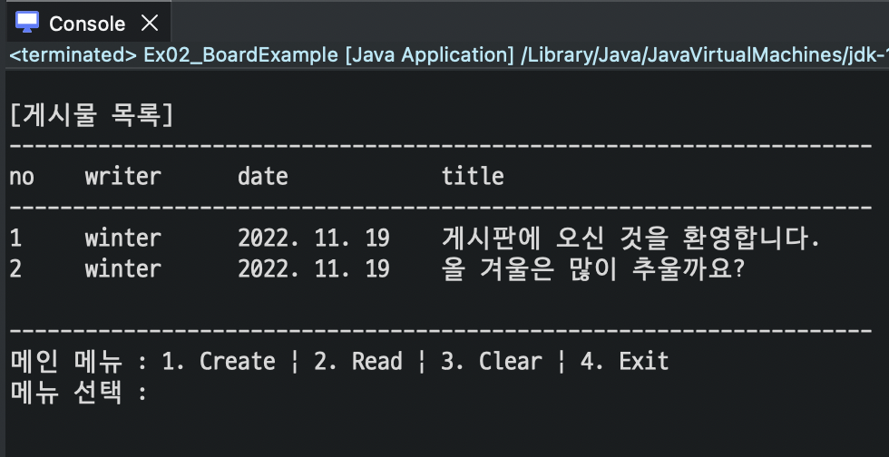
 
[🔗 BoardExample_1](https://github.com/NOSTALJIAN/JAVA/blob/25cfb773a01c0d7f9ef99bc0f2a772d7941537c1/Jian/jdbc/day02/Ex02_BoardExample_1.java)

 

### 📍 메인 메뉴 선택 기능

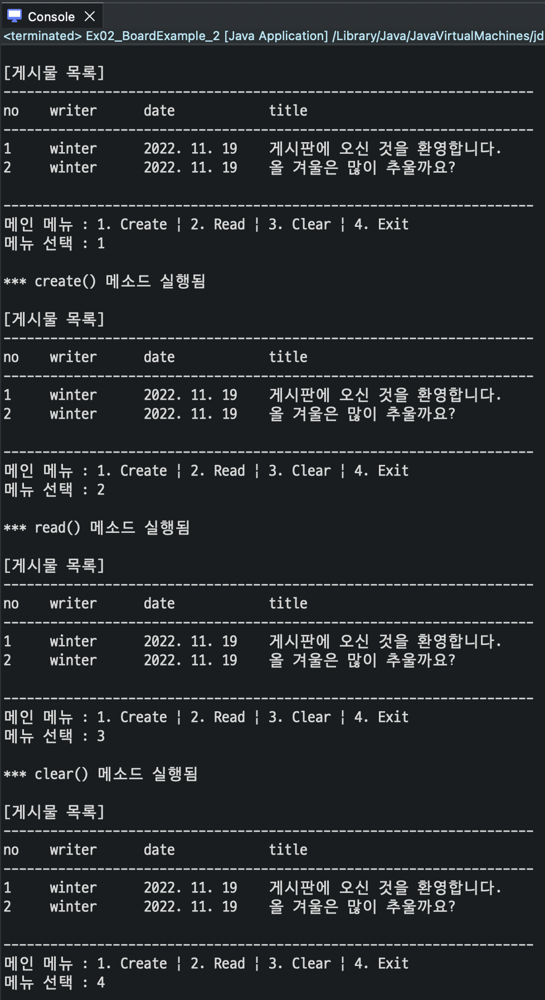
 
[🔗 BoardExample_2](https://github.com/NOSTALJIAN/JAVA/blob/e2bd4d06c5686e639dc5fa6a40b78b90b4b2bf0a/Jian/jdbc/day02/Ex02_BoardExample_2.java)

 

### 📍 게시물

#### 1️⃣ Board 클래스 작성

- board 테이블의 한 개의 행(게시물)을 저장할 Board 클래스 작성
- 컬럼 개수와 타입에 맞게 필드 선언
- 롬복 @Data 어노테이션 사용 - Getter, Setter, toString()

[🔗 BoardClass](https://github.com/NOSTALJIAN/JAVA/blob/f0f527d3c40810fa3a90e1a0fd37df0a2a3d8b79/Jian/jdbc/day02/Ex02_Board.java)

 

#### 2️⃣ 게시물 목록 기능

- boards 테이블의 모든 게시물 정보를 가져와서 출력

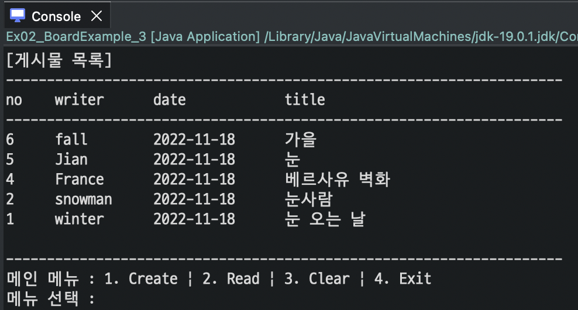
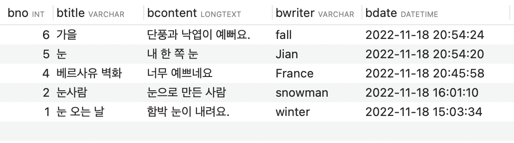
 
[🔗 BoardExample_boards](https://github.com/NOSTALJIAN/JAVA/blob/f0f527d3c40810fa3a90e1a0fd37df0a2a3d8b79/Jian/jdbc/day02/Ex02_BoardExample_3.java)

 

#### 3️⃣ 게시물 생성 기능

- `1. Create` 선택 시 새로운 게시물의 제목, 내용, 작성자를 키보드로 입력받기
- 보조 메뉴에서 `1. Ok` 선택 시 boards 테이블에 새로운 게시물이 저장되도록 설정

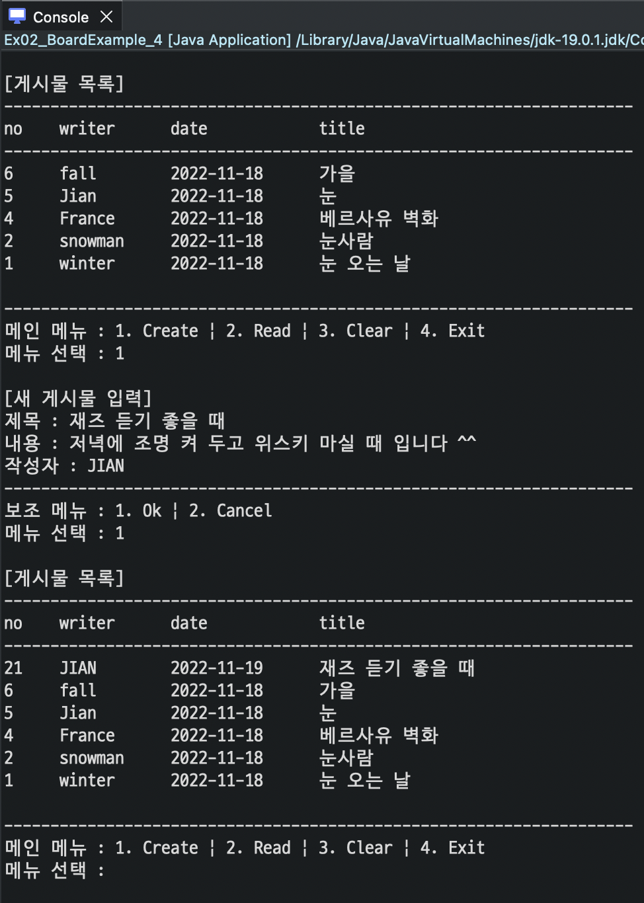
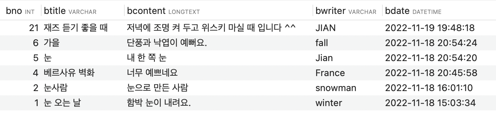
 
[🔗 BoardExample_Create](https://github.com/NOSTALJIAN/JAVA/blob/12535bad54588c57b9b01cd0b494dab88daba3bf/Jian/jdbc/day02/Ex02_BoardExample_4.java)

 

#### 4️⃣ 게시물 읽기 기능

- `2. Read` 선택 시 게시물의 번호를 키보드로 입력받고 가져와서 출력

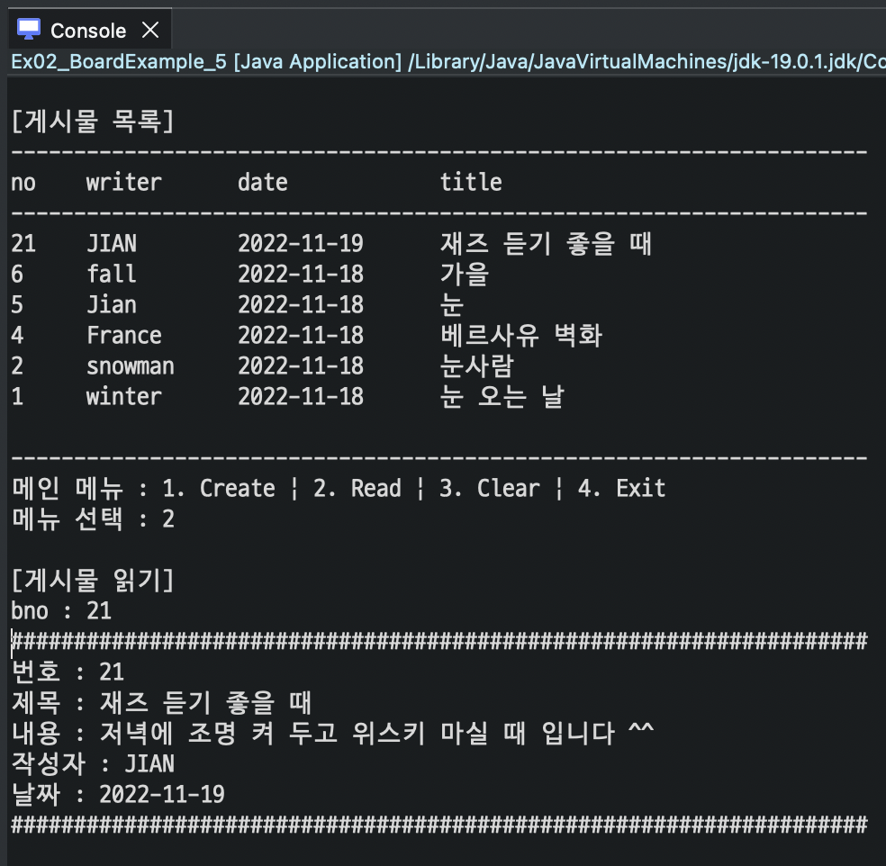
 
[🔗 BoardExample_Read](https://github.com/NOSTALJIAN/JAVA/blob/d0deec6271c7fba3eee5dfb6e1100099f0cc14e3/Jian/jdbc/day02/Ex02_BoardExample_5.java)

 

#### 5️⃣ 게시물 수정, 삭제 기능

- 게시물 읽기에서 보조 메뉴를 추가
- `1. Update` 선택 시 제목, 내용, 작성자의 수정 내용을 입력
- 보조 메뉴에서 `1. Ok` 선택 시 boards 테이블의 해당 게시물 수정
- 보조 메뉴에서 `2. Delete` 선택 시 boards 테이블에서 해당 게시물을 삭제

🔖 수정
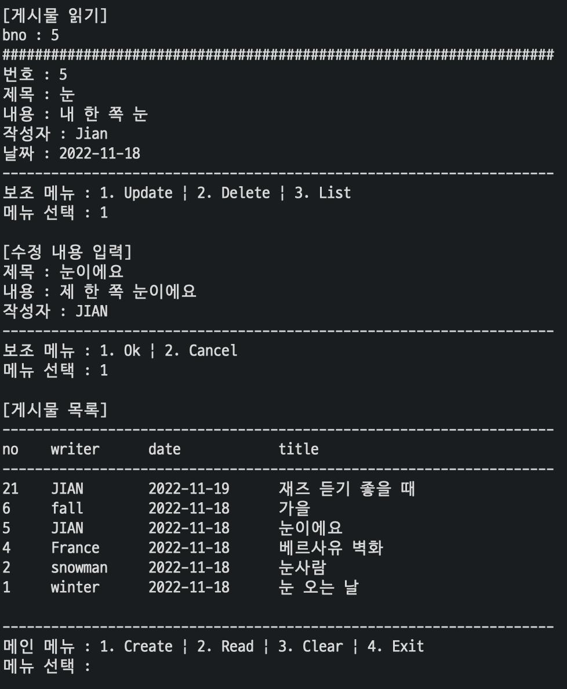
🔖삭제
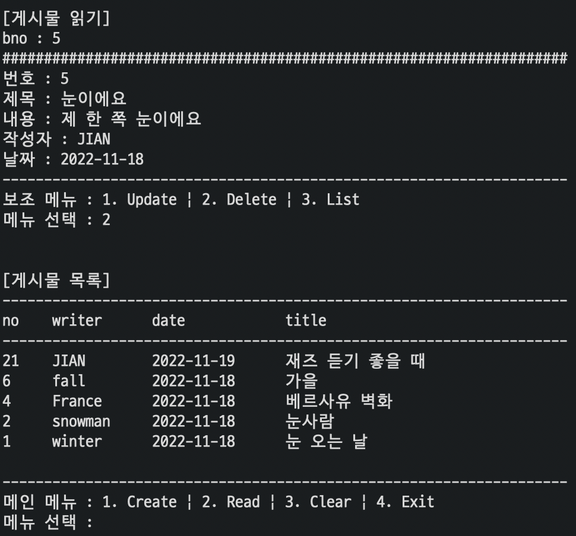
 
[🔗 BoardExample_Update&Delete](https://github.com/NOSTALJIAN/JAVA/blob/037bf5376e657d21cb6d835bc977a28b32bc87e3/Jian/jdbc/day02/Ex02_BoardExample_6.java)
 

#### 6️⃣ 게시물 전체 삭제 기능

- 메인 메뉴에서 `3. Clear` 를 선택하고 보조 메뉴에서 `1. Ok` 선택 시 boards 테이블의 전체 게시물 정보 삭제

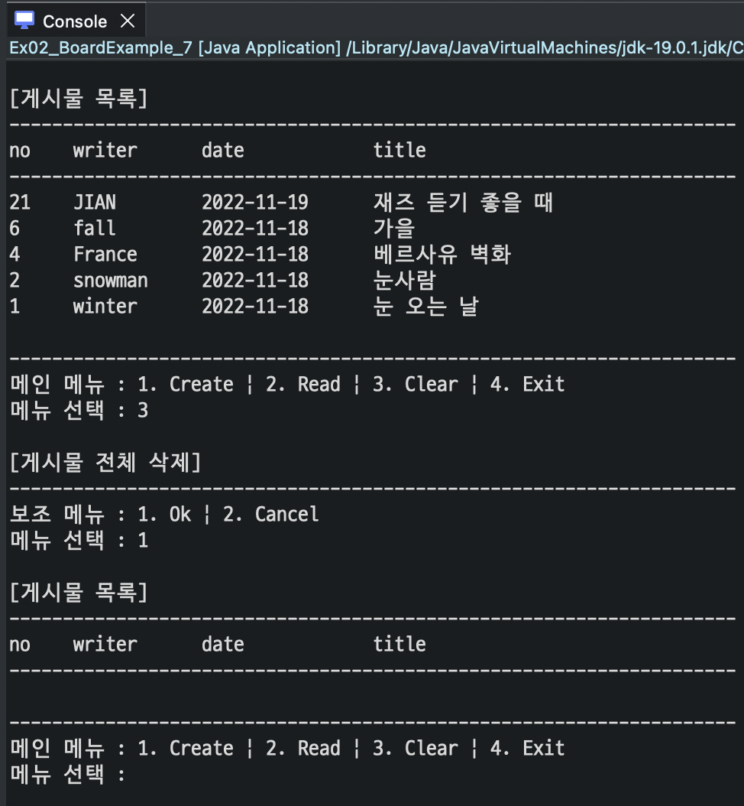
 
[🔗 BoardExample_DeleteAll](https://github.com/NOSTALJIAN/JAVA/blob/2c835423bf0289793fff50347c6b537d025846bb/Jian/jdbc/day02/Ex02_BoardExample_7.java)

 

#### 7️⃣ 종료 기능

- 메인 메뉴에서 `4. Exit` 선택 시 Connection을 닫고 프로그램 종료

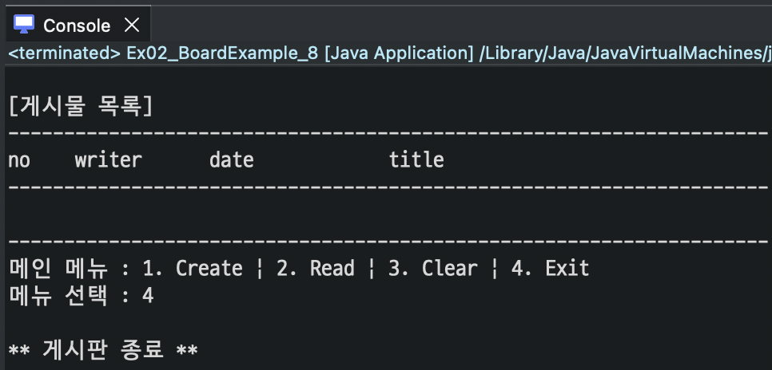
 
[🔗 BoardExample_Exit](https://github.com/NOSTALJIAN/JAVA/blob/7d27c3d74f1fb090849fe53a31cdf47045f53c50/Jian/jdbc/day02/Ex02_BoardExample_8.java)

 

---

 

<!--END-->