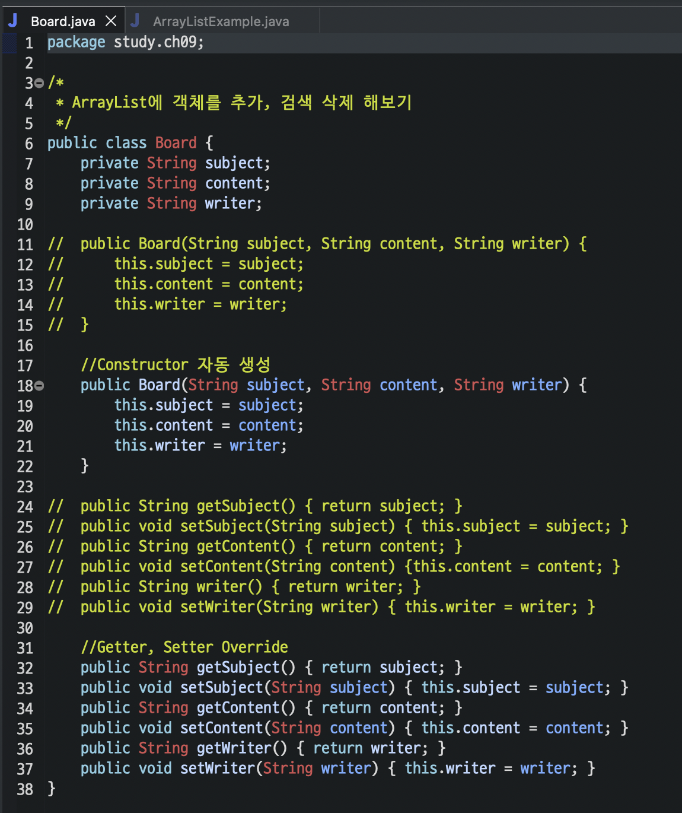
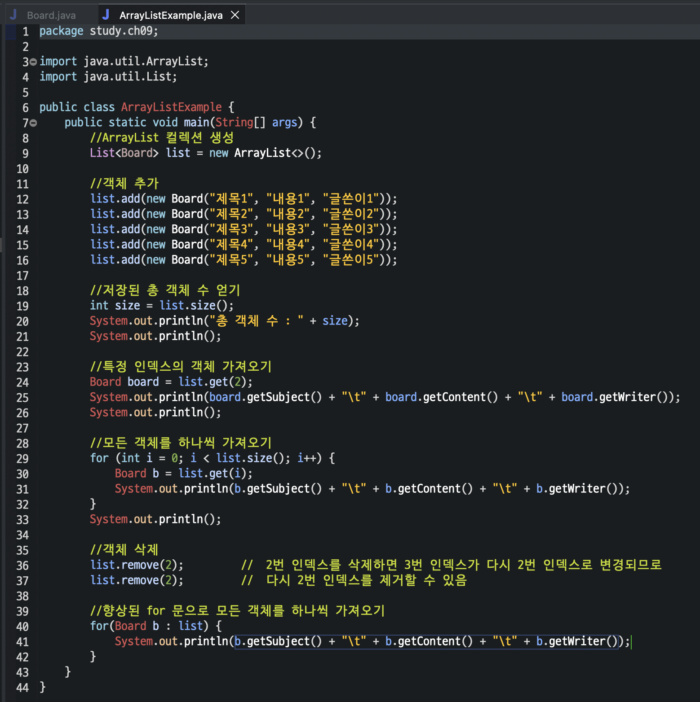
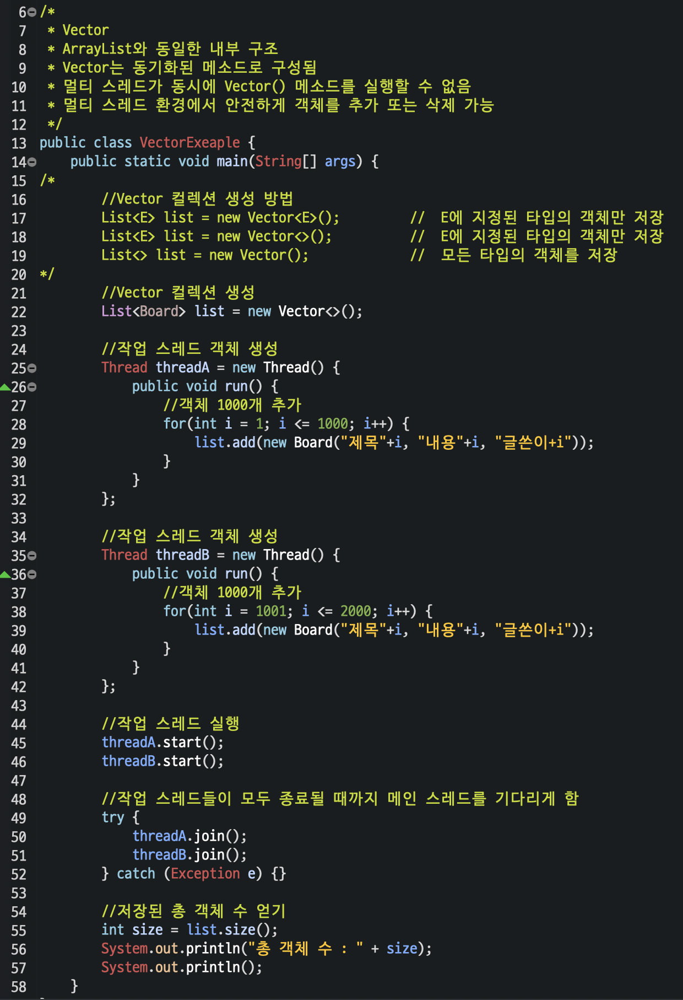
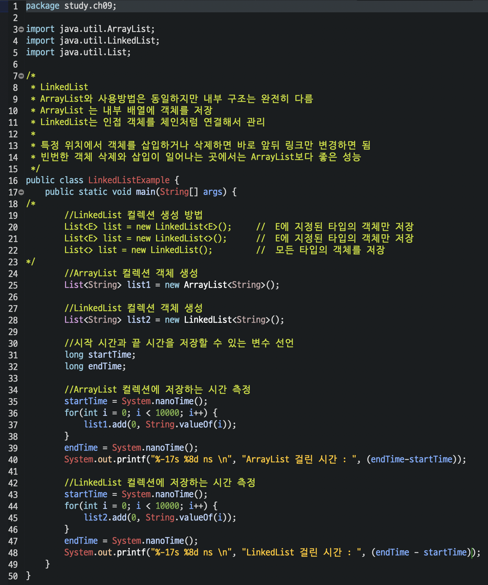
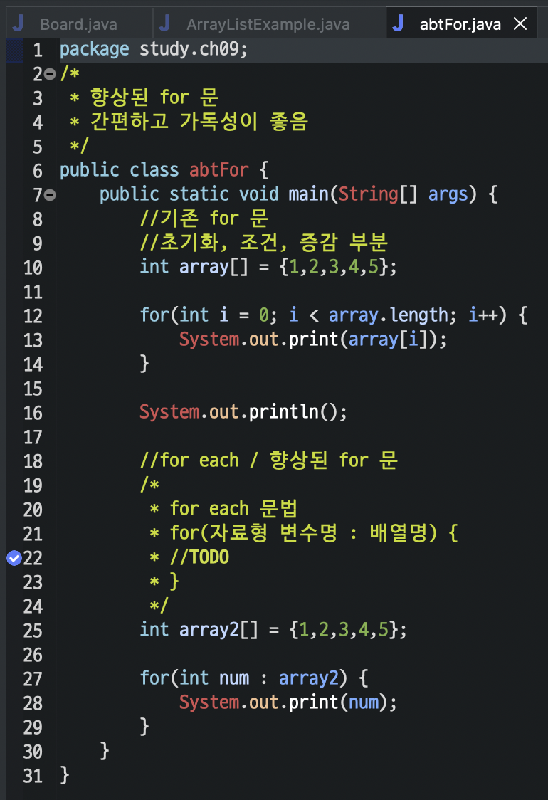

# ❤️‍🔥 **TIL DAY 12** ❤️‍🔥

> 📆 2022년 11월 22일 화요일

 

---

 

오늘은 시험 ✏️  
자신이 없다 ㅜㅜ 🥲  

 

---

 

## ❗️ 자주 틀렸던 실수

- **`String sql = ""`** 문 쓸 때  
  `MySQL`에서 작성했던 **쿼리 그대로(띄어쓰기까지)** 작성해야 함
- 앞에 **`TAP`** 무시하고 실행하면 오류 생김

 

---

 

## 💡 Java 복습

### 📍 ArrayList

- Board

[🔗 Board](https://github.com/NOSTALJIAN/JAVA/blob/b8c93c899a2751c843adec1ceab412a560193fd2/Jian/study/ch09/Board.java)

 

---

 

- ArrayList

[🔗 ArrayListExample](https://github.com/NOSTALJIAN/JAVA/blob/b8c93c899a2751c843adec1ceab412a560193fd2/Jian/study/ch09/ArrayListExample.java)

 

---

 

### 📍 Vector

[🔗 VectorExample](https://github.com/NOSTALJIAN/JAVA/blob/b8c93c899a2751c843adec1ceab412a560193fd2/Jian/study/ch09/VectorExeaple.java)

 

---

 

### 📍 LinkedList

[🔗 LinkedListExample](https://github.com/NOSTALJIAN/JAVA/blob/b8c93c899a2751c843adec1ceab412a560193fd2/Jian/study/ch09/LinkedListExample.java)

 

---

 

### 📍 abtFor (향상된 For 문, 일반 For 문)

[🔗 abtFor](https://github.com/NOSTALJIAN/JAVA/blob/b8c93c899a2751c843adec1ceab412a560193fd2/Jian/study/ch09/abtFor.java)

 

---

 

<!--END-->