# ❤️‍🔥 **TIL DAY 13** ❤️‍🔥

> 📆 2022년 11월 23일 수요일

 

---

 

PMS 너무 심하다 진짜 넘 아푸넹  
 
HTML5 첫날..!! 😵  

오늘은 과제를 할 계획.. 금요일 자정까지 제출해야함..!!  

 

---

 

## 💡 Java 복습

 

### 📍 HashSet

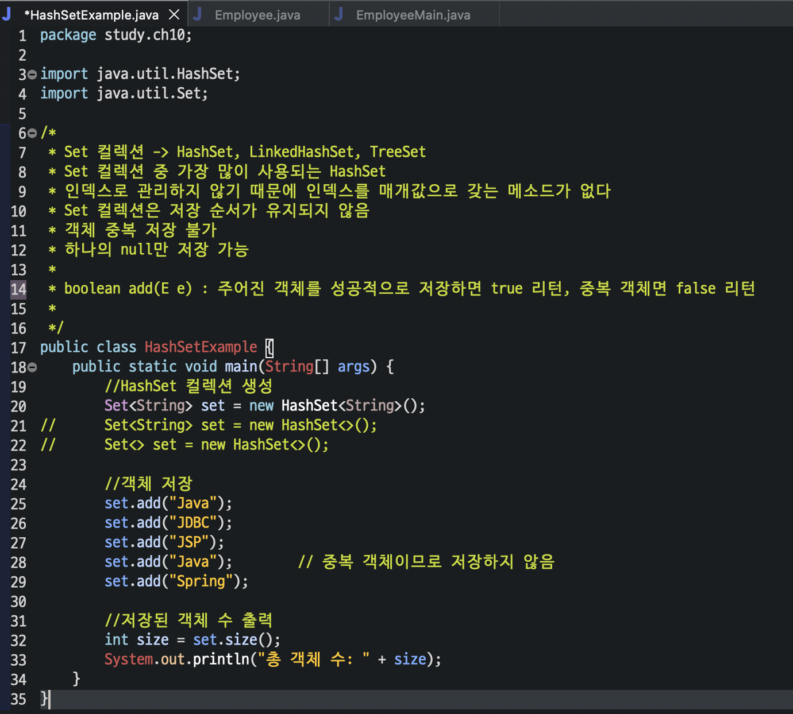
[🔗 HashSetExample_1](https://github.com/NOSTALJIAN/JAVA/blob/d70d7d317eb1e0a899b9b152ad45fc96c7c6a6d1/Jian/study/ch10/HashSetExample.java)

 

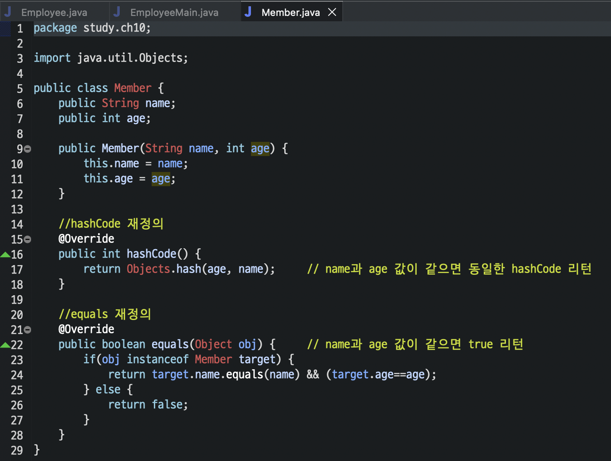
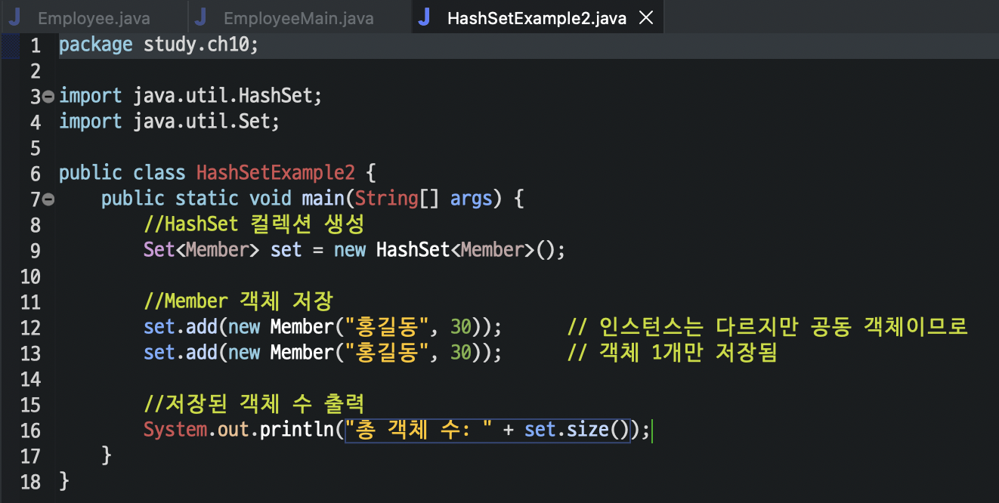
[🔗 Member](https://github.com/NOSTALJIAN/JAVA/blob/d70d7d317eb1e0a899b9b152ad45fc96c7c6a6d1/Jian/study/ch10/Member.java)
[🔗 HashSetExample_2](https://github.com/NOSTALJIAN/JAVA/blob/d70d7d317eb1e0a899b9b152ad45fc96c7c6a6d1/Jian/study/ch10/HashSetExample2.java)

 

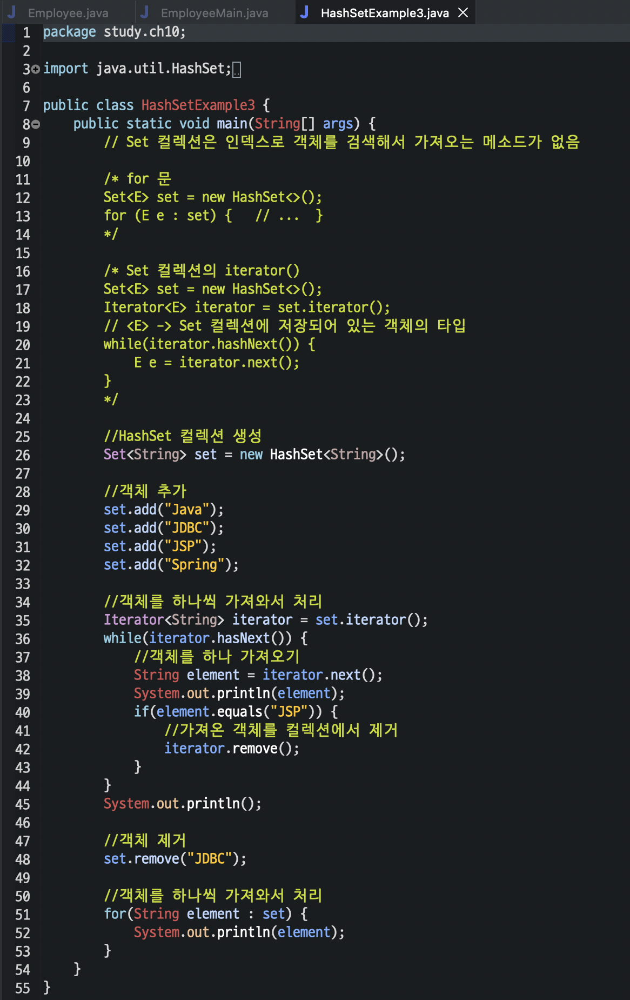
[🔗 HashSetExample_3](https://github.com/NOSTALJIAN/JAVA/blob/d70d7d317eb1e0a899b9b152ad45fc96c7c6a6d1/Jian/study/ch10/HashSetExample3.java)

 

---

 

## 📚 과제

 

### 📑 메소드 재정의와 Set Collection

#### ❗️ 다음과 같은 요구사항을 만족하도록 Employee 클래스를 작성하시오

##### 1️⃣ 종업원 정보는 사번(id), 이름(name), 직급(position), 입사일자(joinDate)로 표현

###### 단, 데이터 타입은 int, String, String, LocalDate 로 할 것

##### 2️⃣ 기본 생성자와 모든 종업원 정보를 매개변수로 갖는 생성자

##### 3️⃣ Employee 클래스가 가지고 있는 정보를 문자열로 변환하는 toString() 메소드

##### 4️⃣ 사번과 이름으로 객체를 구분할 수 있는 hashCode()와 equals() 메소드

 

 

---

 

#### ❗️ Employee 클래스가 정상적으로 동작하기 위한 EmployeeMain 클래스를 작성하시오

- ✔️ HashSet에 다음의 5명을 입력하고 그 결과를 출력한다.

        133, "강자바", "부장", 2000-08-01
        143, "은전기", "차장", 2003-01-01
        163, "노전자", "과장", 2018-08-01
        173, "권표준", "대리", 2022-01-01
        213, "홍정부", "사원", 2019-01-01

 

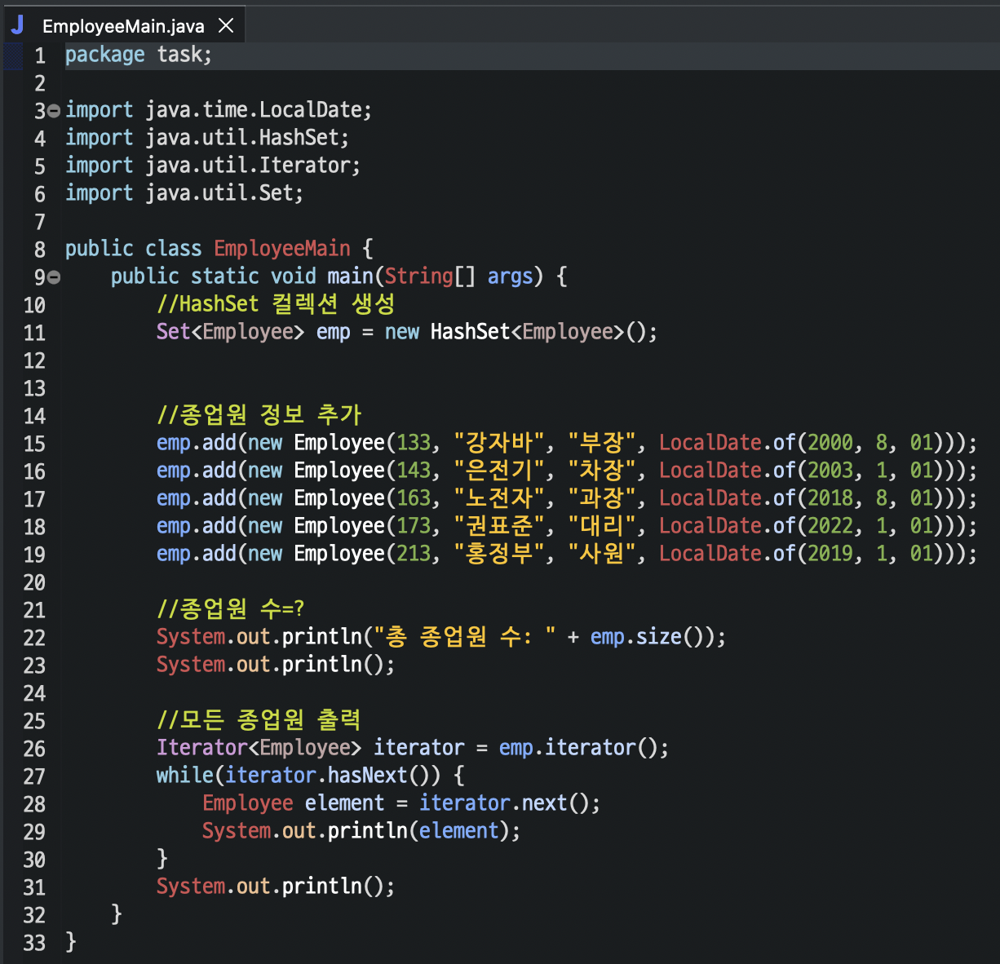
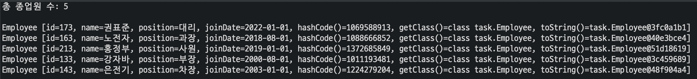

 

- ✔️ 다음의 두명을 HashSet에 추가한 후 모든 종업원을 출력한다.

        123, "김자바", "부장", 1998-01-01
        163, "노전자", "사원", 2008-08-01

 

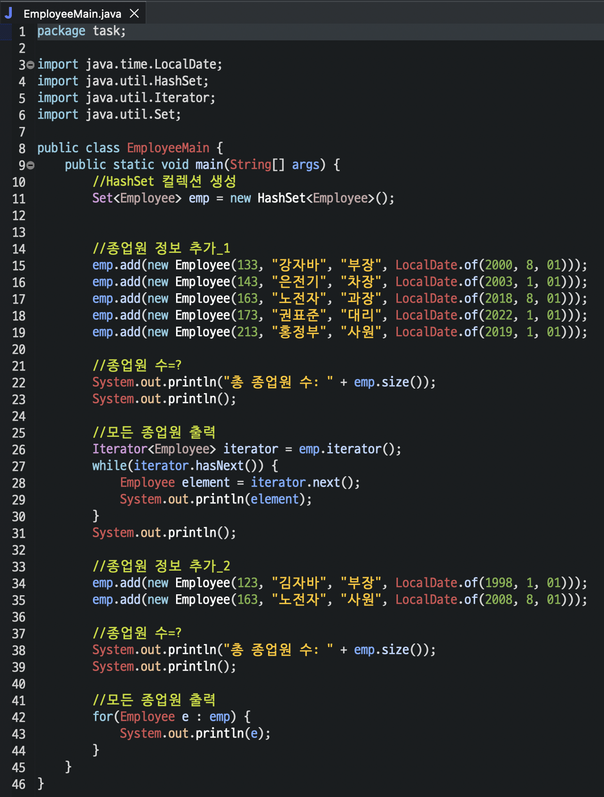
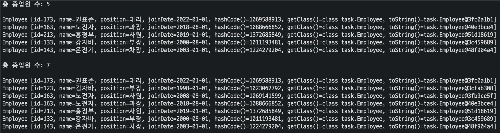

 

[🔗 EmployeeClass](https://github.com/NOSTALJIAN/JAVA/blob/5178aead9c9802c64951b408301b116d3d2787b1/Jian/task/Employee.java)
 
[🔗 EmployeeMainClass](https://github.com/NOSTALJIAN/JAVA/blob/703cdc09a754d38a3a391a8a4adcbb9c7a1bc53a/Jian/task/EmployeeMain.java)

 

---

 

### 📑 MySQL의 이해와 활용

#### ❗️ 실습1의 필드를 저장하는 테이블(employee)을 생성하되 다음의 메소드를 만들어서 하시오

|필드명|데이터 타입|Null|Key|Default|
|:---:|:---:|:---:|:---:|:---:|
|id|INT|No|PRI||
|name|VARCHAR(4)|NO|||
|position|VARCHAR(4)|NO|||
|joinDate|DATETIME|Yes|||

        public void createTable() {
            // 위의 테이블이 생성되도록 코드를 작성하시오
        }

 

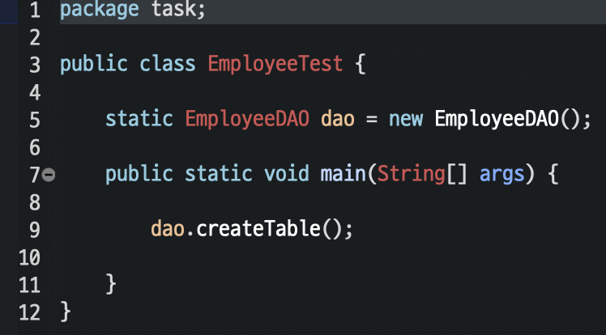

 

#### ❗️ 실습1에서 처음에 입력했던 5명을 다음의 메소드를 만들어서 DB에 넣으시오

        public void insertEmployee(Employee emp) {
            // 실습 1에서 HashSet에 입력했던 데이터가 테이블에 insert 되도록 코드를 작성하시오
        }

 

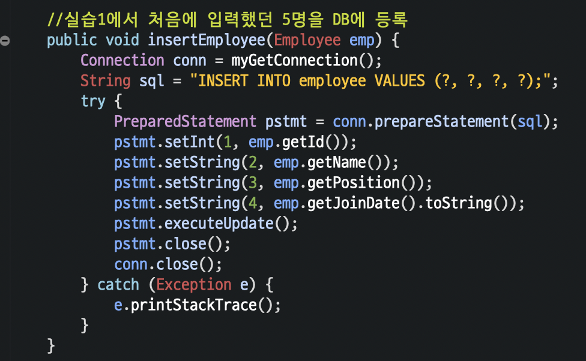
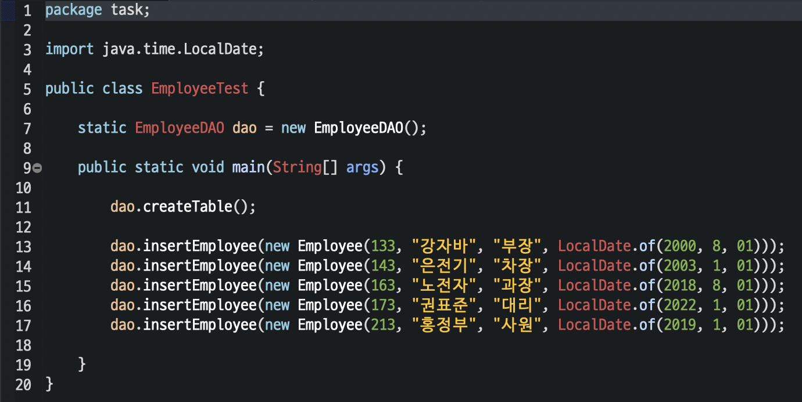

 

#### ❗️ 위에서 입력한 레코드를 조회하는 메소드를 만들어서 출력하시오

단, 입사일자의 오름차순으로 정렬하시오

        public void printAllEmployee()  {
                // 종업원 데이터가 입사일자의 오름차순으로 정렬되어 출력하시오
        }

 

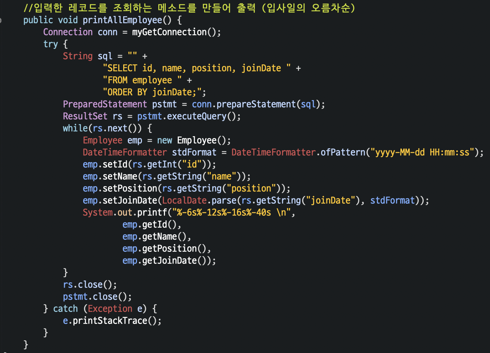
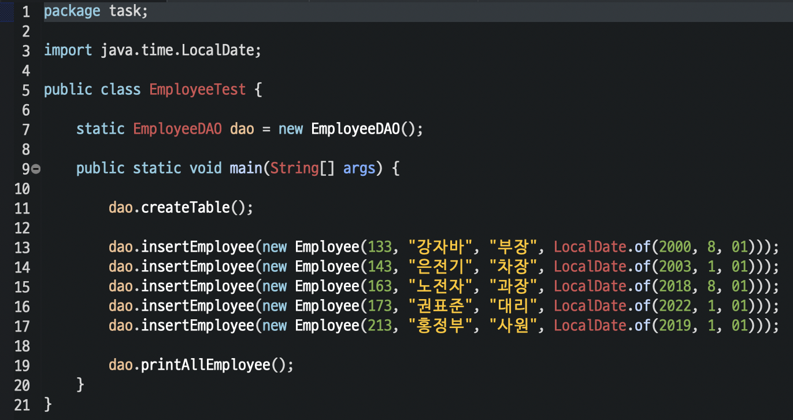
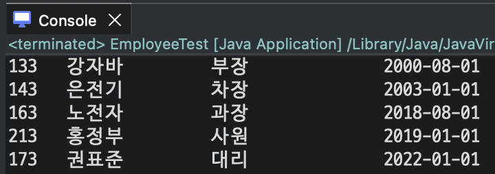
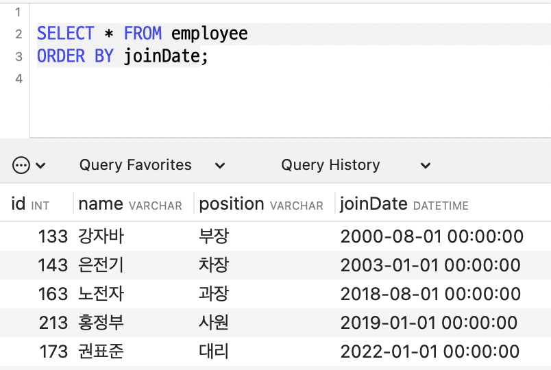

 

#### 📨  결과 제출 방식

- 파일명: 이클립스 패키지를 "db_과제2_이름.zip" 으로 압축하여 제출
  - ex) db_과제2_홍길동.zip

<!--END-->