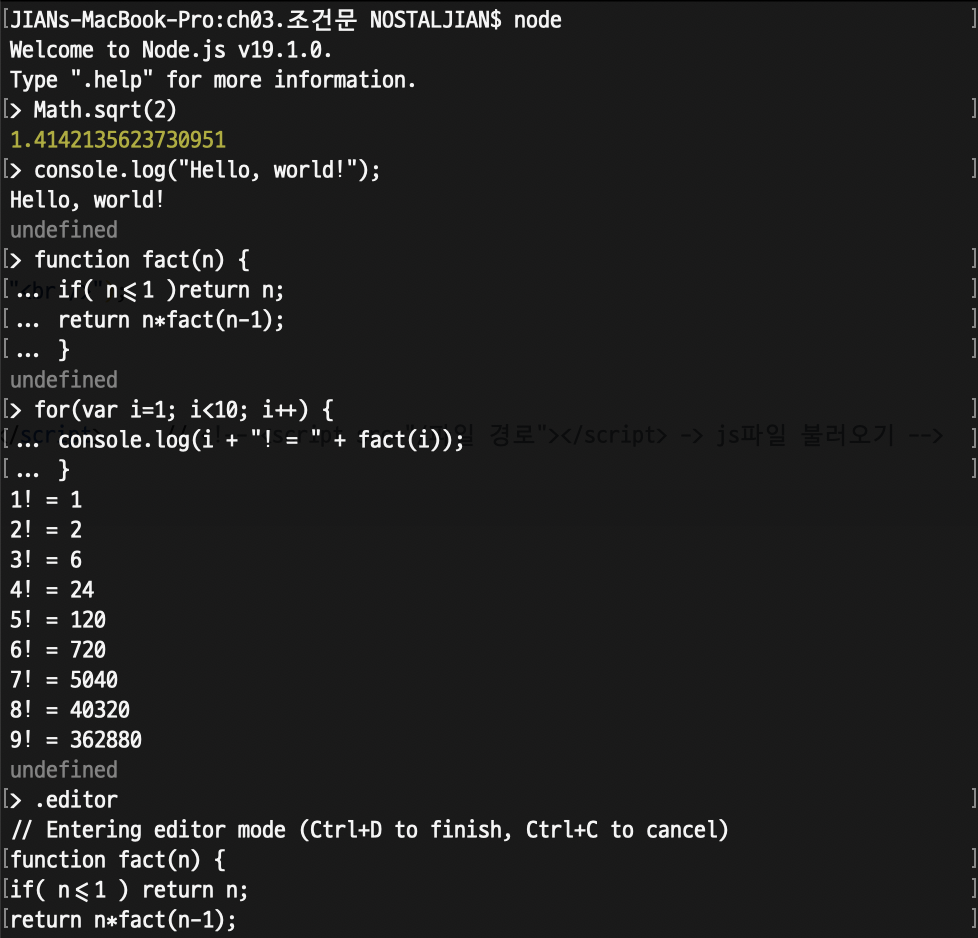

# ❤️‍🔥 **TIL DAY 15** ❤️‍🔥

> 📆 2022년 11월 30일 수요일

 

---

 

피곤.. 아직도 모기가 활개치는게 말이 되나..  
어제 큰일 치르고,, 이젠 몸 괜찮아지겠지..!  
빨리 몸 회복하고 다시 열심히 할 수 있는 컨디션이 돌아왔으면 좋겠음 🥲  

 

---

 

## 📚 JavaScript

> Homebrew 이용해서 node.js 설치

 

### 💡 Node.js 대화형 모드

- 터미널에 `node` 입력

 

 

---

 

### 💡 Node.js 파일을 읽어 들여서 실행

- 터미널에서 `$ node /파일경로` 입력

 

 

---

 

### 💡 문자 코드

- 유니코드 문자로 작성

 

---

 

### 💡 대문자와 소문자

- **JavaScript**는 알파벳 대문자와 소문자를 구별함
  - `a`와 `A`
  - `console`과 `Console`

- 오류 예시 (`console.log` 코드를 `Console.log` 로 입력 시)
  - 

 

---

 

### 💡 토큰

- 프로그램을 구성하는 최소 단위
- 자바스크립트 인터프리터는 프로그램 실행 전 프로그램을 토큰으로 분해(어휘 분석)
- 영어 문장에서는 단어가 토큰
- 'JavaScript is powerful.'
  - `JavaScript`, `is`, `powerful`라는 단어 세 개와 마침표(.)가 토큰
- 의미를 가지는 최소한의 문자 덩어리
- `return n*fact(n-1);` -> return | n | * | fact | ( | n | - | 1 | ) | ;

#### 📍 파싱(구문 분석)

- 어휘 분석 후 토큰을 한 줄로 나열하고 올바른 프로그램인지 판정하는 동작
- 파싱 후 문제가 없으면 프로그램 실행

 

---

 

### 💡 표현식과 문장

- 표현식

      273
      10 + 20 + 30 * 2
      "JavaScript Programming"

- 문장 : 표현식이 하나 이상 모일 경우, 마지막 종결 의미로 세미콜론(;)
- 프로그램 : 문장이 모이면 프로그램이 됨

 

---

 

### 💡 식별자

- 이름을 붙일 때 사용하는 단어
- 변수와 함수 이름 등으로 사용
- 키워드를 사용할 수 없음
- 특수문자는 `_` 와 `$` 만 사용 가능
- 숫자로 시작할 수 없음
- 공백을 입력할 수 없음

      # 식별자로 사용 가능한 단어
      alpha
      alpha10
      _alpha
      $alpha
      AlPha
      ALPHA

      # 식별자로 사용 불가한 단어
      break
      273alpha
      has space

- 생성자 함수의 이름은 **항상 대문자**로 시작
- 변수, 함수, 속성, 메소드의 이름은 **항상 소문자**로 시작
- 여러 단어로 된 식별자는 각 단어의 첫 글자를 대문자로 함

      will out      //  willOut
      will return   //  willReturn
      i am a boy    //  iAmABoy

- 식별자 뒤에 괄호가 없을 경우
  - 단독 사용 시 : 변수 또는 상수
  - 다른 식별자와 사용 시 : 속성
- 식별자 뒤에 괄호가 있는 경우
  - 단독 사용 시 : 함수
  - 다른 식별자와 사용 시 : 메소드
- example

      alert('Hello World')          //  함수
      Array.length                  //  속성
      input                         //  변수 또는 상수
      propmt('Message', 'Defstr')   //  함수
      Math.PI                       //  속성
      Math.abs(-273)                //  메소드

 

---

 

### 💡 공백 문자 생략

공백 문자가 없어도 토큰을 판별할 수 있는 경우

        a = 1 + 2 * 3 ;     -> a=1+2*3;
        function fact( n )  -> function fact(n)
        { x : 1 , y : 2 }   -> {x:1,y:2}
        obj . x             -> obj.x
        [ 1 , 2 , 3 ]       -> [1,2,3]
        a [ 0 ] = 10;       -> a[0]=10;

- `=`, `+`, `*`, `/` 같은 산술 연산자 앞뒤의 공백 문자
- `(`, `)`, `{`, `}`, `[`, `]` 같은 괄호 앞뒤의 공백 문자
- `;`, `,`, `:`, `.` 앞뒤의 공백 문자
- 이러한 토큰은 **분리자** 또는 **구분자** 라고 부름
- `.`의 앞뒤, `[`의 앞부분 공백 문자는 반드시 생략함

 

---

 

### 💡 이스케이프 시퀀스

- `\0` -> null 문자
- `\b` -> 백스페이스 문자
- `\t` -> 수평 탭 문자
- `\n` -> 개행 문자
- `\v` -> 수직 탭 문자
- `\f` -> 다음 페이지 문자
- `\r` -> 캐리지 리턴 문자(CR)
- `\'` -> 작은따옴표 문자
- `\"` -> 큰따옴표 문자
- `\\` -> 역슬래시 문자
- `\xXX` -> 두 자릿수 16진수 XX로 지정된 Latin-1 문자
- `\uXXXX` -> 네 자릿수 16진수 XXXX로 지정된 유니코드 문자
- `\u{XXXXXX}` -> 16진수 코드 포인트 XXXXXX로 지정된 유니코드 문자

<!--END-->