# ❤️‍🔥 **TIL DAY 15** ❤️‍🔥

> 📆 2022년 11월 30일 수요일

 

---

 

피곤.. 아직도 모기가 활개치는게 말이 되나..  
어제 큰일 치르고,, 이젠 몸 괜찮아지겠지..!  
빨리 몸 회복하고 다시 열심히 할 수 있는 컨디션이 돌아왔으면 좋겠음 🥲  

 

---

 

## 📚 JavaScript

> Homebrew 이용해서 node.js 설치

 

### 💡 Node.js 대화형 모드

- 터미널에 `node` 입력

 

 

---

 

### 💡 Node.js 파일을 읽어 들여서 실행

- 터미널에서 `$ node /파일경로` 입력

 

 

---

 

### 💡 문자 코드

- 유니코드 문자로 작성

 

---

 

### 💡 대문자와 소문자

- **JavaScript**는 알파벳 대문자와 소문자를 구별함
  - `a`와 `A`
  - `console`과 `Console`

- 오류 예시 (`console.log` 코드를 `Console.log` 로 입력 시)
  - 

 

---

 

### 💡 토큰

- 프로그램을 구성하는 최소 단위
- 자바스크립트 인터프리터는 프로그램 실행 전 프로그램을 토큰으로 분해(어휘 분석)
- 영어 문장에서는 단어가 토큰
- 'JavaScript is powerful.'
  - `JavaScript`, `is`, `powerful`라는 단어 세 개와 마침표(.)가 토큰
- 의미를 가지는 최소한의 문자 덩어리
- `return n*fact(n-1);` -> return | n | * | fact | ( | n | - | 1 | ) | ;

#### 📍 파싱(구문 분석)

- 어휘 분석 후 토큰을 한 줄로 나열하고 올바른 프로그램인지 판정하는 동작
- 파싱 후 문제가 없으면 프로그램 실행

 

---

 

### 💡 표현식과 문장

- 표현식

      273
      10 + 20 + 30 * 2
      "JavaScript Programming"

- 문장 : 표현식이 하나 이상 모일 경우, 마지막 종결 의미로 세미콜론(;)
- 프로그램 : 문장이 모이면 프로그램이 됨

 

---

 

### 💡 식별자

- 이름을 붙일 때 사용하는 단어
- 변수와 함수 이름 등으로 사용
- 키워드를 사용할 수 없음
- 특수문자는 `_` 와 `$` 만 사용 가능
- 숫자로 시작할 수 없음
- 공백을 입력할 수 없음

      # 식별자로 사용 가능한 단어
      alpha
      alpha10
      _alpha
      $alpha
      AlPha
      ALPHA

      # 식별자로 사용 불가한 단어
      break
      273alpha
      has space

- 생성자 함수의 이름은 **항상 대문자**로 시작
- 변수, 함수, 속성, 메소드의 이름은 **항상 소문자**로 시작
- 여러 단어로 된 식별자는 각 단어의 첫 글자를 대문자로 함

      will out      //  willOut
      will return   //  willReturn
      i am a boy    //  iAmABoy

- 식별자 뒤에 괄호가 없을 경우
  - 단독 사용 시 : 변수 또는 상수
  - 다른 식별자와 사용 시 : 속성
- 식별자 뒤에 괄호가 있는 경우
  - 단독 사용 시 : 함수
  - 다른 식별자와 사용 시 : 메소드
- example

      alert('Hello World')          //  함수
      Array.length                  //  속성
      input                         //  변수 또는 상수
      propmt('Message', 'Defstr')   //  함수
      Math.PI                       //  속성
      Math.abs(-273)                //  메소드

 

---

 

### 💡 공백 문자 생략

공백 문자가 없어도 토큰을 판별할 수 있는 경우

        a = 1 + 2 * 3 ;     -> a=1+2*3;
        function fact( n )  -> function fact(n)
        { x : 1 , y : 2 }   -> {x:1,y:2}
        obj . x             -> obj.x
        [ 1 , 2 , 3 ]       -> [1,2,3]
        a [ 0 ] = 10;       -> a[0]=10;

- `=`, `+`, `*`, `/` 같은 산술 연산자 앞뒤의 공백 문자
- `(`, `)`, `{`, `}`, `[`, `]` 같은 괄호 앞뒤의 공백 문자
- `;`, `,`, `:`, `.` 앞뒤의 공백 문자
- 이러한 토큰은 **분리자** 또는 **구분자** 라고 부름
- `.`의 앞뒤, `[`의 앞부분 공백 문자는 반드시 생략함

 

---

 

### 💡 이스케이프 시퀀스

- `\0` -> null 문자
- `\b` -> 백스페이스 문자
- `\t` -> 수평 탭 문자
- `\n` -> 개행 문자
- `\v` -> 수직 탭 문자
- `\f` -> 다음 페이지 문자
- `\r` -> 캐리지 리턴 문자(CR)
- `\'` -> 작은따옴표 문자
- `\"` -> 큰따옴표 문자
- `\\` -> 역슬래시 문자
- `\xXX` -> 두 자릿수 16진수 XX로 지정된 Latin-1 문자
- `\uXXXX` -> 네 자릿수 16진수 XXXX로 지정된 유니코드 문자
- `\u{XXXXXX}` -> 16진수 코드 포인트 XXXXXX로 지정된 유니코드 문자

 

---

 

### 💡 주석

- 프로그램 진행에 영향을 주지 않는 코드
- 한 줄 주석 처리 -> `// 주석`
- 여러 줄 주석 처리 ->
  `/*
  주석
  */`

      // 주석은 코드의 실행에 영향을 주지 않음
      /*
      console.log("JavaScript Programming")
      console.log("JavaScript Programming")
      console.log("JavaScript Programming")
      */

 

---

 

### 💡 출력

#### 📍 출력 메소드

- console 객체의 log() 메소드 사용
- `console.log()` 메소드

      console.log("문자열")
      console.log("JavaScript Programming");
      -> JavaScript Programming 출력

 

#### 📍 REPL을 사용한 출력

- 곧바로 문장을 입력해서 출력

      > 문장
      출력_결과

  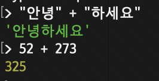

 

---

 

### 💡 기본 자료형

#### 📍 숫자

- 가장 기본적인 자료형

      console.log(52);
      console.log(52.271);

      > 52 + 273
      325

  

- `+` : 덧셈 연산자
- `-` : 뺄셈 연산자
- `*` : 곱셈 연산자
- `/` : 나눗셈 연산자

- 연산자 우선순위

      console.log(5 + 3 * 2);

  

- `%`나머지 연산자

      > 10 % 5
      0
      > 7 % 3
      1

   
  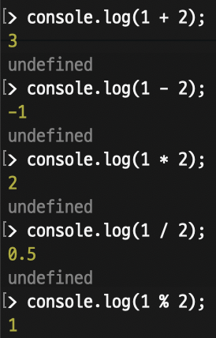

 

---

 

#### 📍 문자열

- 문자의 집합
- 문자열 생성시 큰따옴표나 작은따옴표 사용

      > "안녕하세요"
      '안녕하세요'
      > '안녕하세요'
      '안녕하세요'

      > console.log("This is 'String'")
      This is 'String'
      undefined
      > console.log('This is "String"')
      This is "String"
      undefined

   
  

 

#### 📍 이스케이프 문자

- 따옴표를 문자 그대로 사용 가능
- 문자열 줄바꿈 할 경우 사용

      > console.log("This is \"String\"")
      This is "String"
      undefined
      > console.log('This is \'String\'')
      This is 'String'
      undefined

      > console.log("동해물과 백두산이\n마르고 닳도록");
      동해물과 백두산이
      마르고 닳도록
      undefined

  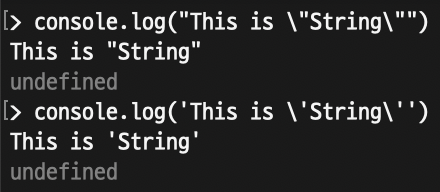 
  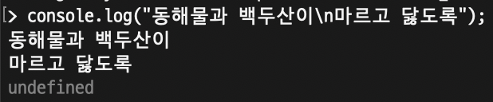

- `\t` - 수평 탭
- `\n` - 줄바꿈
- `\'` - 작은따옴표
- `\"` - 큰따옴표
- `\\` - 역슬래시  
  

 

#### 📍 문자열 합하기

- `+` : 문자열 연결 연산자

  

 

#### 📍 문자 선택 연산자

- `문자열[숫자]` : 문자 선택 연산자

  ![string[num]](/IMAGE/string%5Bnum%5D.png)

 

#### 📍 템플릿 문자열

    > `안녕하세요`
    '안녕하세요'

    >`52 + 273 = ${52 + 273}`
    '52 + 273 = 325'

 

---

 

#### 📍 불(boolean)

- 참과 거짓의 표현 : `true`와 `false`

      > true
      true
      > false
      false

      52 < 273
      52 > 273

  

 

- 비교 연산자
  - `==` : 같다.
  - `!=` : 다르다.
  - `>` : 왼쪽 피연산자가 크다.
  - `<` : 오른쪽 피연산자가 크다.
  - `>=` : 왼쪽 피연산자가 크거나 같다.
  - `<=` : 오른쪽 피연산자가 크거나 같다.

 

- boolean과 비교 연산자

      console.log(52 < 273);          //  true
      console.log(52 > 273);          //  false
      console.log("하마" < "가방");     //  false

  

 

- `!` : 논리 부정 연산자
- `||` : 논리합 연산자 (이항 연산자)

  |왼쪽 피연산자|오른쪽 피연산자|결과|
  |:---:|:---:|:---:|
  |true|true|true|
  |true|false|true|
  |flase|true|true|
  |false|false|false|

- `&&` : 논리곱 연산자 (이항 연산자)

  |왼쪽 피연산자|오른쪽 피연산자|결과|
  |:---:|:---:|:---:|
  |true|true|true|
  |true|false|false|
  |false|true|false|
  |false|false|false|

 

- 논리 연산자는 **범위 판단**에서 주로 사용

      ex) 비교 연산자의 잘못된 사용
      30 > 20 > 10

      30 > 20 > 10
      (30 > 20) > 10
      true > 10
      1 > 10
      false

      비교 연산자가 여러 개 있을 때,
      왼쪽부터 차례대로 연산하면서 발생하는 문제

 

- `x < 3 또는 8 < x`의 범위
  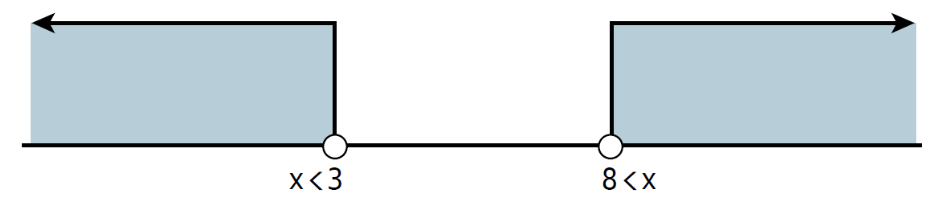
- `3 < x 그리고 x < 8`의 범위
  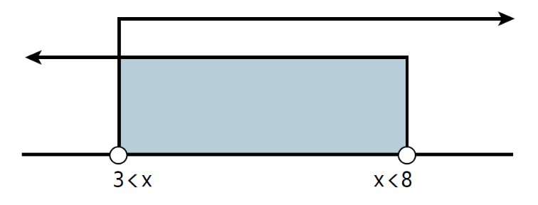

 

- 현재 시간을 구하는 방법

      let hours = (new Date()).getHours();

      console.log(hours < 3 || 8 < hours);
      console.log(3 <= hours && hours <=8);

  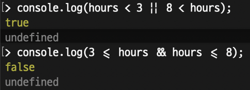

 

---

 

### 💡 변수

#### 📍 변수 초기화

    > let pi = 3.14159265;
    undefined

 

#### 📍 변수 활용

    > let pi = 3.14159265;
    undefined
    > console.log(pi);
    3.14159265
    undefined

 

#### 📍 변수 기본 사용 방법

- 반지름과 파이 값을 저장하고, 원의 둘레와 넓이를 계산

      let pi = 3.14159265;
      let radius = 10;

      console.log(`둘레: ${2 * pi * radius}`);
      console.log(`넓이: ${pi * radius * radius}`);

      # 실행 결과
      둘레: 62.831853
      넓이: 314.159265

  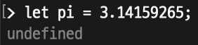
  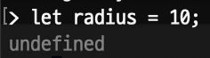
  

 

---

 

### 💡 복합 대입 연산자

- 변수에 사용할 수 있는 몇 개의 특별한 연산자
  - `a += 10`과 `a = a + 10`의 결과는 같음

 

- `+=` : 숫자 덧셈 후 대입 연산자
- `-=` : 숫자 뺄셈 후 대입 연산자
- `*=` : 숫자 곱셈 후 대입 연산자
- `/=` : 숫자 나눗셈 후 대입 연산자
- `+=` : 문자열 연결 후 대입 연산자

 

#### 📍 숫자와 관련된 복합 대입 연산자

    let output = 0;
    output += 52;
    output += 273;
    output += 103;

    console.log(output);

    let output = 0;
    output = output + 52;
    output = output + 273;
    output = output + 103;

    console.log(output);

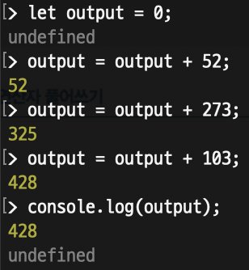

 

#### 📍 문자열과 관련된 복합 대입 연산자

    let output = "hello ";
    output += "world ";
    output += "!";

    console.log(output);
    -> hello world !

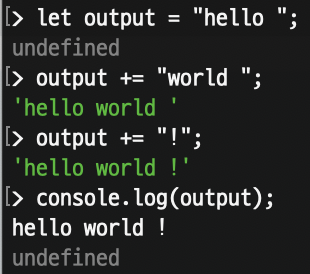

 

    let output = "hello ";
    output = output + "world ";
    output = output + "!";

    console.log(output);

 

---

 

### 💡 증감 연산자

- 변수 number를 초기화하고, ++ 연산자와 -- 연산자를 사용
- 각 연산자에서 변수 값이 1만큼 변경됨

 

|연산자|설명|
|:--:|:--:|
|변수++|기존 변수 값에 1을 더함(후위)|
|++변수|기존 변수 값에 1을 더함(전위)|
|변수--|기존 변수 값에서 1을 뺌(후위)|
|--변수|기존 변수 값에서 1을 뺌(전위)|

    let number = 10;

    number++;
    console.log(number);
    number--;
    console.log(number);

    # 실행 결과
    11
    10

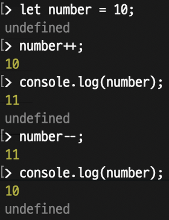

 

#### 📍 증감 연산자 전위

    let number = 10;

    console.log(number);
    console.log(number++);
    console.log(number--);
    console.log(number);

 

#### 📍 증감 연산자 후위

    let number = 10;

    console.log(number);
    console.log(++number);
    console.log(--number);
    console.log(number);

 

- 문장을 실행하기 전에 값을 변경하라는 의미
- `console.log(++number)` 코드는 `console.log(number)`를 실행하고 변수 `number`에 1을 더함

  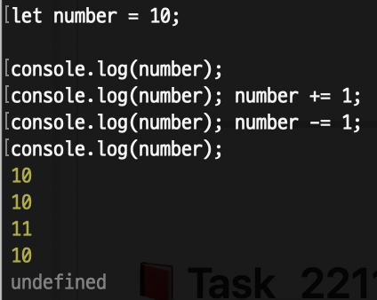

 

- 차례대로 **`10, 12, 12, 10`** 을 출력하는 코드

      let number = 10;

      console.log(number++);
      console.log(++number);
      console.log(number--);
      console.log(--number);

  

      let number = 10;

      console.log(number);
      number++;
      number++;
      console.log(number);
      console.log(number);
      number--;
      number--;
      console.log(number);

  

 

---

 

### 💡 자료형 검사

#### 📍 자료형 확인 연산자

- `typeof` : 해당 변수의 자료형을 추출

      > typeof 10
      'number'
      > typeof "문자열"
      'string'

  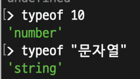

 

- 보통 연산자 뒤에 괄호를 붙임

      > typeof (10)
      'number'
      > typeof ("문자열")
      'string'

  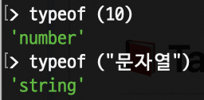

 

- 자바스크립트의 여섯 가지 자료형

      > // 문자열
      > typeof('String')
      'string'

      > // 숫자
      > typeof(273)
      'number'

      > // 불
      > typeof(true)
      'boolean'

      > // 함수
      > typeof(function () {})
      'function'

      > // 객체
      > typeof({})
      'object'

      > // undefined
      > let alpha
      > typeof(alpha)
      'undefined'

  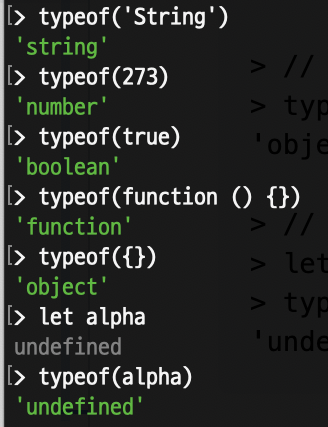

 

---

 

### 💡 undefined 자료형

- 변수를 선언했으나 초기화하지 않은 자료형

      > let a       //  초기화하지 않은 변수
      undefined
      > typeof(a)
      'undefined'

      > typeof(b)   //  선언하지 않았던 식별자
      'undefined'

  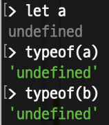

 

---

 

### 💡 강제 자료형 변환

#### 📍 강제 자료형 변환 함수

- `Number()` : 숫자로 자료형 변환
- `String()` : 문자열로 자료형 변환
- `Boolean()` : 불로 자료형 변환

 

#### 📍 `String()` 함수

    // 숫자는 그대로 문자열로 바뀜
    > String(52)
    '52'
    > String(273)
    '273'

    // 불도 그대로 문자열로 바뀜
    > String(true)
    'true'
    > String(false)
    'false'

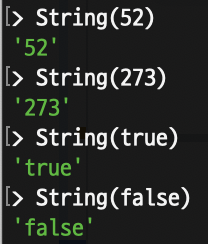

 

#### 📍 `Number()` 함수

    console.log(Number("52"));
    console.log(Number("52.273"));
    console.log(Number(true));
    console.log(Number(false));
    console.log(Number("안녕하세요"));  //  숫자로 변환할 수 없는 문자열

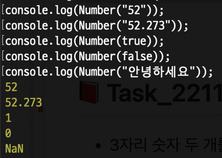

 

#### 📍 `NaN`

- **숫자로 변환할 수 없는 문자열**을 `Number()` 함수로 변환하면 `NaN`을 출력
- `NaN(Not a Number)` : 숫자 자료형이지만 숫자가 아닌 것
- `NaN`은 무조건적으로 다름
- `NaN`인지 확인할 때는 `isNaN()` 함수 사용

      // NaN 변수를 만듬
      let nan = Number("안녕하세요");

      // nan끼리 비교
      console.log(nan == nan);
      console.log(nan != nan);

      // isNaN() 함수로 NaN인지 확인
      console.log(isNaN(nan));

  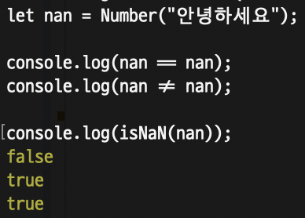

 

#### 📍 `Boolean()` 함수

- `Boolean()` 함수 사용 시 `false` 변환되는 요소
  - `0`
  - `NaN`
  - `""`(빈 문자열)
  - `null`
  - `undefined`

- **이 외에는 모두 `true`로 변환**

      // 변수 선언
      let nan = Number("안녕하세요");
      let undefinedVariable;

      // Boolean() 함수 사용
      console.log(Boolean(0));
      console.log(Boolean(nan));
      console.log(Boolean(""));
      console.log(Boolean(null));
      console.log(Boolean(undefinedVariable));

  .png)

 

---

 

### 💡 자동 자료형 변환

#### 📍 숫자와 문자열 자료형 자동 변환

- 숫자와 문자열에 `+` 연산자를 적용하면 자동으로 숫자가 문자열로 변환됨

      console.log(52 + 273);
      console.log("52" + 273);
      console.log(52 + "273");
      console.log("52" + "273");

  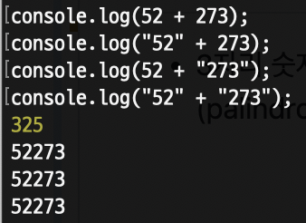

 

- ex) 다른 연산자 대입

      console.log("52" - 273);
      console.log("52" * 273);
      console.log("52" / 273);
      console.log("52" % 273);

  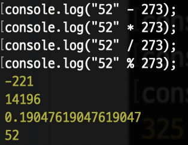

 

#### 📍 불 자료형 자동 변환

- `!` 연산자를 두 번 사용해 `Boolean()` 함수를 사용하는 것과 같은 효과

      let nan = Number("안녕하세요");
      let undefinedVariable;

      console.log(!!0);
      console.log(!!nan);
      console.log(!!"");
      console.log(!!null);
      console.log(!!undefinedVariable);

  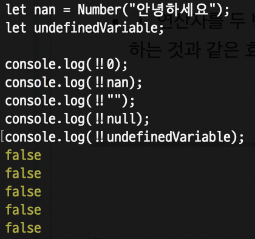

 

---

 

### 💡 일치 연산자

#### 📍 자료형까지 검사

- `===` : 자료형과 값이 같은지 비교
- `!==` : 자료형과 값이 다른지 비교

      console.log(`52 == "52": ${52 == "52"}`);
      console.log(`52 === "52": ${52 === "52"}`);
      console.log();
      console.log(`0 == "": ${0 == ""}`);
      console.log(`0 === "": ${0 === ""}`);

  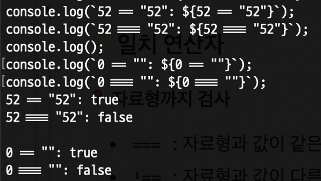

 

---

 

### 💡 상수

- **항상 같은 수**라는 의미, 변수와 반대되는 개념
- **`const`** : 상수(constant)를 만드는 키워드
- 변하지 않을 대상에 상수를 적용

 

- 상수와 오류

      // 상수 선언
      const constant = "변경할 수 없어요";
      constant = "";

      // 출력
      console.log(constant);

  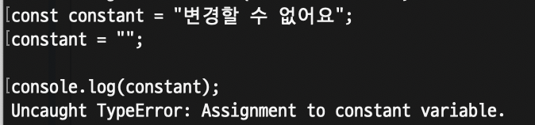

      const a = "처음 선언할 때 값을 할당해야 함";
      const b;

  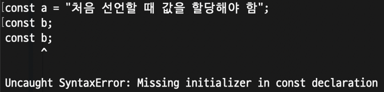

 

---

 

## 📕 Task_221130

- 3자리 숫자 두 개를 곱해서 만든 수 중에서 대칭수(palindrome) 이면서 가장 큰 값을 구하시오.

<!--END-->