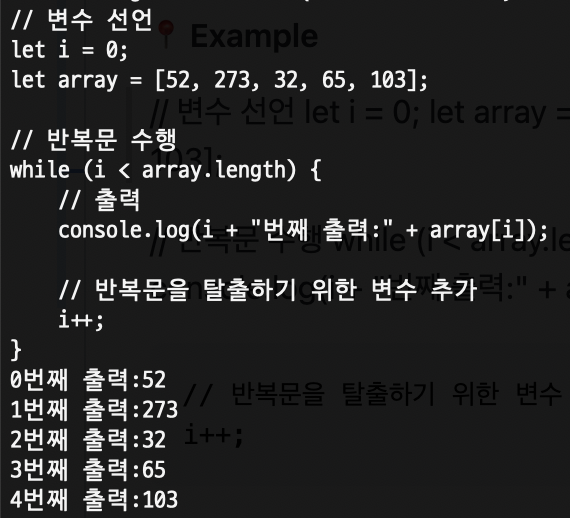
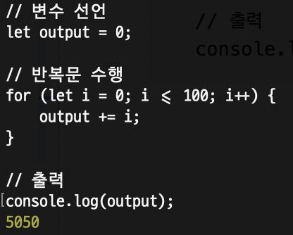
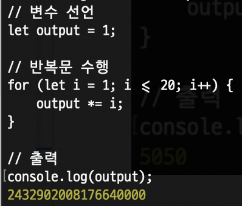
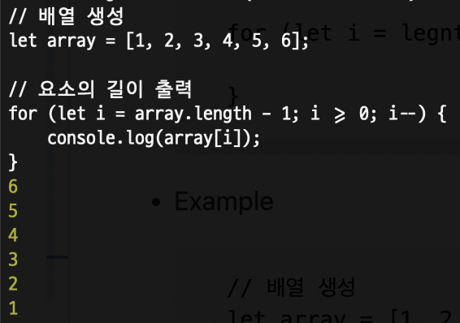
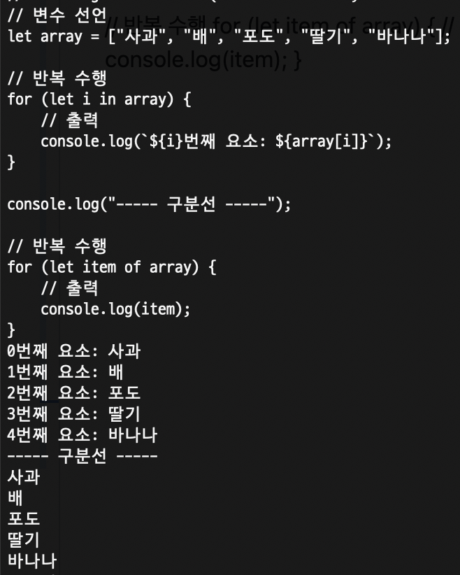

# ❤️‍🔥 **TIL DAY 16** ❤️‍🔥

> 📆 2022년 12월 1일 목요일

 

---

 

12월 첫날!!!  

 

---

 

## 📚 JavaScript_반복문

- 붙여 넣기를 사용한 반복

            console.log("출력");
            console.log("출력");
            console.log("출력");
            console.log("출력");
            console.log("출력");

- 반복문을 사용한 반복

            for (let i = 0; i < 1000; i++) {
                console.log("출력");
            }

 

### 💡 배열

 

#### 📍 배열 생성 방법

- 여러 개의 자료를 한꺼번에 다룰 수 있는 자료형
- 대괄호 내부의 각 자료는 쉼표로 구분
- 배열에는 여러 자료형이 섞여 있을 수 있음
- `let 이름 = [자료, 자료, 자료, 자료, 자료]`

            > let array = [52, 273, '아침밥', '점심밥', true, false]
            undefined
            > array
            [52, 273, '아침밥', '점심밥', true, false]

 

#### 📍 배열의 요소와 인덱스

- **요소(Element)** : 배열 안에 들어있는 각 자료, 배열의 요소에 접근할 때는 대괄호를 사용
- **인덱스(Index)** : 대괄호 안에 넣는 숫자

 

- **`배열[인덱스]`**

 

        //배열 생성
        let array = [52, 273, '아침밥', '점심밥', true, false]

        //배열 요소 변경
        array[0] = 0

        //요소 출력
        console.log(array[0]);
        console.log(array[1]);
        console.log(array[2]);
        console.log(array[3]);
        console.log(array[4]);

![array[index]_1](/IMAGE/array%5Bindex%5D_1.png)

 

---

 

#### 📍 while 반복문

- 기본 형태

        while (불_표현식) {
            // 불 표현식이 참인 동안 실행할 문장
        }

        # 무한 반복문
        while (true) {
            console.log("무한 반복");
        }

 

- Example

        // 변수 선언
        let i = 0;
        let array = [52, 273, 32, 65, 103];

        // 반복문 수행
        while (i < array.length) {
            // 출력
            console.log(i + "번째 출력:" + array[i]);

            // 반복문을 탈출하기 위한 변수 추가
            i++;
        }

    

 

---

 

#### 📍 for 반복문

- for 반복문의 각 단계
  1. 초기식을 비교
  2. 조건식을 비교하고 조건이 `false`이면 반복문을 종료
  3. 문장을 실행
  4. 종결식을 실행
  5. 2단계로 이동

 

- 기본 형태

            for (let i = 0; i < 반복_횟수; i++) {

            }

 

- for 반복문을 이용한 덧셈

        # 0부터 100까지 더하기

        // 변수 선언
        let output = 0;

        // 반복문 수행
        for (let i = 0; i <= 100; i++) {
            output += i;
        }

        // 출력
        console.log(output);

    

 

- for 반복문을 이용한 곱셈

        # 1부터 20까지 곱하기
        
        // 변수 선언
        let output = 1;     // 초기값을 0으로 놓으면 무엇을 곱해도 0이 됨. 따라서 1로 설정

        // 반복문 수행
        for (let i = 1; i <= 20; i++) {
            output *= i;
        }

        // 출력
        console.log(output);

    

 

---

 

#### 📍 역 for 반복문

- 배열의 요소를 뒤쪽부터 출력

        for (let i = legnth - 1; i >= 0; i--) {
            
        }

 

- Example

        // 배열 생성
        let array = [1, 2, 3, 4, 5, 6];

        // 요소의 길이 출력
        for (let i = array.length - 1; i >= 0; i--) {
            console.log(array[i]);
        }

    

 

---

 

#### 📍 `for in 반복문` & `for of 반복문`

- 객체에 쉽게 반복문을 적용
- `for 반복문` 사용과 같은 역할

        # for in 반복문
        for (let 인덱스 in 배열) {

        }

        # for of 반복문
        for (let 요소 of 배열) {

        }

        # for 반복문
        for (let i = 0; i < 배열.길이; i++) {
            let 인덱스 = i;
            let 요소 = 배열[i];
        }

 

- Example

        // 변수 선언
        let array = ["사과", "배", "포도", "딸기", "바나나"];

        // 반복 수행
        for (let i in array) {
            // 출력
            console.log(`${i}번째 요소: ${array[i]}`);
        }

        console.log("----- 구분선 -----");

        // 반복 수행
        for (let item of array) {
            // 출력
            console.log(item);
        }

    

 

---

 

#### 📍 중첩 반복문

- 반복문을 여러 번 중첩해서 사용

 

- 별 피라미드 1️⃣

let output = '';

for (let i = 0; i < 10; i++) {
    for (let j = 0; )
}

<!--END-->