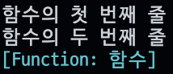
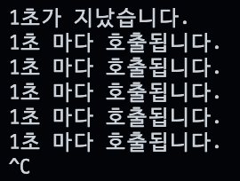

# ❤️‍🔥 **TIL DAY 17** ❤️‍🔥

> 📆 2022년 12월 5일 월요일

 

---

 

요즘 너무 나태해진듯  
정신차리자  

 

---

 

## 📚 Task_221202

 

---

 

## 📚 JavaScript 반복문

### 📍 중첩 반복문

> 반복문을 여러 번 중첩해서 사용

 

#### 1️⃣ 별 피라미드

      let output = '';

      for (let i = 0; i < 10; i++) {
      for (let j = 0; j < i + 1; j++) {
        output += '*';
      }
      output += '\n';
      }

      console.log(output);

 

#### 2️⃣ 별 피라미드

    let output = '';

    for (let i = 0; i < 10; i++) {
      for (let j = 0; j < 10 - i; j++) {
        output += ' ';
      }
      for (let j = 0; j < i + 1; j++) {
        output += '*';
      }
      output += '\n';
    }

    console.log(output);

 

---

 

### 📍 break

> 반복문을 벗어날 때 사용

    while (true) {

    }

 

#### 🖤 짝수를 찾으면 break 키워드로 반복문을 벗어남

    let i = 0;
    let array = [1, 31, 273, 57, 8, 11, 32];
    let output;

    while (true) {
      if (array[i] % 2 == 0) {
        output = array[i];
        break;
      }

      i = i + 1;
    }

    console.log(`처음 발견한 짝수는 ${output}입니다.`);

 

---

 

### 📍 continue

> 반복문 내부에서 현재 반복을 멈추고 다음 반복을 진행함

 

#### 🖤 Example

변수 i가 짝수일 때 
continue 키워드로 현재 반복을 멈추고 다음 반복을 진행함.  
따라서 코드를 실행하면 홀수만 출력

    for (let i = 1; i < 10; i++) {
      if (i % 2 == 0) {
        continue;   //  짝수면 다음 반복으로 넘어감, 다음 코드 실행 X
      }

      console.log(i);
    }

#### 🖤 Example 코드 간략하게 변경

 
 

    for (let i = 1; i < 10; i++) {
      if (i % 2 != 0) {
        console.log(i);
      }
    }

 

---

 

### 📍 Scope

> 변수를 사용할 수 있는 범위 
> 스코프 == 블록

 

#### 🖤 블록

> 중괄호로 둘러싸는 부분

    if (표현식) {
      // 블록
    }

    for(let i = 0; i < 10; i++) {
      // 블록
    }

    for(lelt item of array) {
      // 블록
    }

- 블록 내부에 선언된 변수는 해당 변수 내부에서만 사용 가능

      {
        let a = 10;
      }

      console.log(a);

- 반복문에 활용된 변수는 해당 블록에 있으므로 외부에서 활용할 수 없음

      for (let i = 0; i < 3; i++) {
        console.log(i);
      }

      console.log(i);   //  변수 i는 해당 블록 외부에서 사용할 수 없음

- 스코프 내부에서 이름 중복

      let a = 1;
      let b = 1;
      {
        let a = 2;
        {
          let a = 3;
          console.log(a);   // 같은 블록에 있는 변수 사용
          console.log(b);   // 상위 블록에 있는 변수 사용
        }
        console.log(a);     // 같은 블록에 있는 변수 사용
        console.log(b);     // 같은 블록에 있는 변수 사용
      }

  

 

---

 

### 📍 호이스팅(Hoisting)

> 해당 블록에서 사용할 변수를 미리 확인해서 정리하는 작업

#### 🖤 Hoisting Error

    let a = 1;
    {
      console.log(a);
      let a = 2;
    }

 

---

 

## 📚 JavaScript 함수

### 📍 함수 생성 방법

#### ❤️‍🔥 익명 함수

- 이름을 붙이지 않고 함수 생성
- 함수를 호출하면 함수 내부의 코드 덩어리가 모두 실행

      let 함수_이름 = function () { };

- Example

      let 함수 = function () {
        console.log('함수의 첫 번째 줄');
        console.log('함수의 두 번째 줄');
      };

      함수();
      console.log(함수);

  

#### ❤️‍🔥 선언적 함수

> 이름을 붙여 함수를 생성

    function 함수_이름() { }

- Example

      function 함수() {
        console.log('함수의 첫 번째 줄');
        console.log('함수의 두 번째 줄');
      }

      함수();
      console.log(함수);

  

- 'console.log (함수)' 부분으로 '[Function: 함수]' 문자를 출력

#### ❤️‍🔥 화살표 함수[ECMAScript6]

    () => { }

- '하나의 표현식을 리턴하는 함수'를 만들 때는 중괄호 생략 가능
- 익명 함수 예제를 화살표 함수로 바꾸기

      // 함수 생성
      let 함수 = () => {
        console.log('함수의 첫 번째 줄');
        console.log('함수의 두 번째 줄');
      };

      함수(); // 함수 호출
      console.log(함수);

  

 

---

 

### 📍 함수의 기본 형태

    function 함수_이름(매개_변수) {
      함수_코드;
      return 리턴_값;
    }

- Example

      // 매개 변수로 넣은 숫자를 제곱하는 power() 함수 생성
      function power(x) {
        return x * x;
      }

      console.log(power(10));
      console.log(power(20));

  

 

#### ❤️‍🔥 매개 변수가 여러 개인 함수

    function multiply(x, y) {
      return x + y;
    }

    console.log(multiply(52, 273));
    console.log(multiply(103, 32));

#### ❤️‍🔥 리턴 없는 함수

    function print(message) {
      console.log(`"${message}"(이)라고 말했습니다!`);
    }

    print('안녕하세요');
    print('자바스크립트 공부');

 

---

 

### 📍 함수의 기본 활용 형태

- 리턴하는 함수의 기본 형태

      function (매개_변수, 매개_변수) {
        let output = 초깃값;
        // output 계산
        return output;
      }

 

- Example - 매개 변수와 리턴(1)

      // min부터 max까지 숫자를 더해 리턴
      function sum(min, max) {
        let output = 0;
        for (let i = min; i <= max; i++) {
          output += i;
        }
        return output;
      }

      console.log(sum(1, 100));

  

- Example - 매개 변수와 리턴(2)

      // min부터 max까지 숫자를 곱해 리턴
      function multiply(min, max) {
        let output = 1;
        for (let i = min; i <= max; i++) {
          output *= i;
        }
        return output;
      }

      console.log(multiply(1, 10));

  

 

---

 

### 📍 함수 매개 변수 초기화

- 매개 변수를 입력하지 않고 함수 호출 -> 실행하면 `undefined`가 출력

      // 함수 선언
      function print(name, count) {
        console.log(`${name}이/가 ${count}개 있습니다.`);
      }

      // 함수 호출
      print('사과', 10);
      print('사과');

  

 

#### 🖤 조건문을 활용한 매개 변수 초기화

> 조건문으로 매개 변수를 확인, count가 undefined일 떄 1로 초기화

    // 함수 선언
    function print(name, count) {

      // 함수 매개 변수 초기화
      if (typeof count == 'undefined') {
        count = 1;
      }

      // 함수 본문
      console.log(`${name}이/가 ${count}개 있습니다.`);
    }

    // 함수 호출
    print('사과');

#### 🖤 짧은 초기화 조건문을 활용한 매개 변수 초기화

> 짧은 초기화 조건문으로 매개 변수를 확인 count가 undifined일 때 1로 초기화

    // 함수 선언
    function print(name, count = 1) {
      console.log(`${name}이/가 ${count}개 있습니다.`);
    }

    // 함수 호출
    print('사과');

 

---

 

### 📍 콜백 함수

> 함수의 매개 변수로 전달되는 함수

    // 함수 선언
    function callTenTimes(callback) {
      // 10회 반복
      for (let i = 0; i < 10; i++) {
        // 매개 변수로 전달된 함수를 호출
        callback();
      }
    }

    // 변수 선언
    callTenTimes(function () {
      console.log('함수 호출');
    });

 

---

 

### 📍 표준 내장 함수

> 자바스크립트에서 기본적으로 지원하는 함수

#### ❤️‍🔥 `parseInt()`함수와 `parseFloat()`함수

> 숫자 변환 함수

|     함수     |         설명         |
| :----------: | :------------------: |
|  parseInt()  | 문자열을 정수로 변환 |
| parseFloat() | 문자열을 실수로 변환 |

 

    // 변수 선언
    let inputA = '52';
    let inputB = '52.273';

    let inputC = '1401동';

    // parseInt() 함수의 기본적인 사용
    console.log(parseInt(inputA));

    // parseInt() 함수와 parseFloat() 함수의 차이
    console.log(parseInt(inputB));
    console.log(parseFloat(inputB));

    // 문자열 뒤에 숫자가 아닌 문자가 포함되어 있을 때
    console.log(parseInt(inputC));

 

- 숫자 생성 방법

| 숫자 생성 방법 |        설명        |
| :------------: | :----------------: |
|     0숫자      | 8진수 숫자를 만듬  |
|      숫자      | 10진수 숫자를 만듬 |
|     0x숫자     | 16진수 숫자를 만듬 |

 

#### ❤️‍🔥 타이머 함수

- '특정 시간 후에' or '특정 시간마다' 어떤 일을 할 때 사용
- 시간은 **밀리초**로 지정, 1초를 나타내려면 1000(밀리초)을 입력

  |          함수           |            설명            |
  | :---------------------: | :------------------------: |
  | setTimeout(함수, 시간)  | 특정 시간 후에 함수를 실행 |
  | setInterval(함수, 시간) | 특정 시간마다 함수를 실행  |

 

- Example

      // 1초 후에
      setTimeout(function () {
        console.log('1초가 지났습니다.');
      }, 1000);

      // 1초마다
      setInterval(function () {
        console.log('1초 마다 호출됩니다.');
      }, 1000);

  

  - Ctrl + C => 종료
  - `^C` => Ctrl + C 의미

 

- `clearInterval()` 함수

      // 1초 마다
      let id = setInterval(function () {
        console.log('출력합니다.');
      }, 1000);

      // 3초 후에
      setTimeout(function () {
        // 타이머 제거
        clearInterval(id);
      }, 3000);

  

 

---

 

### 📍 익명 함수와 선언적 함수의 생성 순서

 

#### ❤️‍🔥 변수 덮어쓰기

    let 변수;
    변수 = 10;
    변수 = 20; // 기존의 값인 10 대신 20으로 덮어씀

    console.log(변수);

 

#### ❤️‍🔥 함수 덮어쓰기 (1)

    let 함수;
    함수 = function () {
      console.log('첫 번째 함수');
    };
    함수 = function () {
      console.log('두 번째 함수');
    };

    함수();

#### ❤️‍🔥 함수 덮어쓰기 (2)

    함수 = function () {
      console.log('첫 번째 함수');
    };
    function 함수() {
      console.log('두 번째 함수');
    }

    함수();

 

#### ❤️‍🔥 Example A, B, C, D

 

---

 

### 📍 익명 함수와 화살표 함수의 차이

> 내부에서 this 키워드가 가지는 의미

#### ❤️‍🔥 익명 함수 생성 후 곧바로 호출

    (function () {
      console.log(this);
    })();

 

#### ❤️‍🔥 화살표 함수 생성 후 곧바로 호출

    (() => {
      console.log(this);
    })();

<!-- END -->
