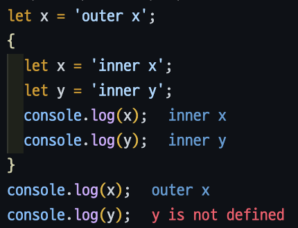
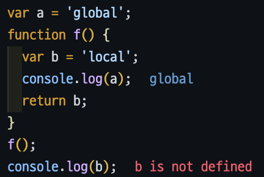

# ❤️‍🔥 TIL Day 18 ❤️‍🔥

> 📆 2022년 12월 6일 화요일

 

---

 

❄️함박눈❄️이 내렸다 아침부터!!!

 

---

 

## 📚 JavaScript 선언자

> `var`, `let`, `const`

 

### 🖤 `var`

#### 📍 변수 선언

    // sum 이라는 이름의 영역 생성
    var sum;

- `var` : 변수를 선언하기 위한 **선언자**
  - 모든 데이터 타입의 값을 저장 가능
- `sum` : **변수 이름**
  - 변수 이름을 이용해 변수 값을 읽거나 쓸 수 있음

 

    var sum, a;

- 변수 여러 개를 한 개의 문장으로 선언 가능

 

    var x;
    console.log(x);   //  -> undefined

- 변수를 선언하기만 하면 변수 안에는 '정의되지 않았음'을 뜻하는 `undefined`라는 값이 들어감

 

    x = 2;

- 대입(=) 연산자를 사용하면 변수에 값을 대입할 수 있음
- 오른쪽 값을 왼쪽 변수에 대입하겠다는 뜻
- 대입을 하면 변수에 저장된 값이 새로운 값으로 바뀜

 

    var x = 5;

- 변수를 선언하면서 초깃값을 설정할 수 있음

 

    var a = 1, b = 2, c = 3;

- 변수를 여러 개 선언하고 초깃값 설정을 쉼표로 구분하여 한 문장으로 표현 가능

 

---

 

#### 📍 변수 선언 생략

    console.log(x);     // -> ReferenceError: x is not defined(오류 메세지)

- `var` 문으로 선언하지 않은 변수 값을 읽으려고 시도하면 참조 오류 발생

 

    x = 2;
    console.log(x);     // -> 2

- `var` 문으로 선언하지 않은 변수에 값을 대입 시에는 오류가 발생하지 않음  : Javascript 엔진이 자동으로 전역변수로 선언하기 때문

 

---

 

#### 📍 변수 끌어올림과 변수 중복 선언

    console.log(x);   // -> undefined
    var x;

- 프로그램 중간에서 변수를 선언하더라도 변수가 프로그램 첫머리에 선언된 것처럼 다른 문장 앞에 생성됨
- **호이스팅(hoisting)** : 변수 선언의 끌어올림

 

    console.log(x);     // -> undefined
    var x = 5;
    console.log(x);     // -> 5

- 선언과 동시에 대입하는 코드는 끌어올리지 않음

 

- `var` 문을 사용하여 같은 이름을 가진 변수를 여러 개 선언해도 문제가 발생하지 않음
  - 같은 이름으로 선언된 변수는 모두 끌어올린 후에 **단 하나의 영역**에만 할당됨

 

---

 

#### 📍 변수의 명명 규칙

##### 🔺 식별자

> 변수, 함수, 라벨 이름 등 사용자가 정의하는 이름

- 사용할 수 있는 문자 : 알파벳(a~z, A~Z), 숫자(0~9), 밑줄(\_), 달러 기호($)
- 첫 글자로는 숫자를 사용할 수 없음
- 첫 글자는 알파벳(a~z, A~Z), 밑줄(\_), 달러 기호($) 중 하나여야 함
- 예약어를 식별자로 사용할 수 없음

 

- 사용 가능
  - key
  - sum1
  - \_name
  - $width
  - sum_all
  - sumAll
  - newValue

 

- 사용 불가
  - 1st (첫 글자가 숫자)
  - sum-all (하이픈 사용 불가)
  - new (예약어)

 

---

 

- 캐멀 표기법(로어 캐멀 표기법)
  - 두 번째 이후 단어의 첫 글자를 대문자로 표기하고 나머지는 소문자로 표기
  - 대문자 부분이 낙타의 혹처럼 보인다고 해서 붙여진 이름
  - `newName`
  - `createLifeGame`

 

- 파스칼 표기법(어퍼 캐멀 표기법)
  - 각 단어의 첫 글자를 대문자로 표기하고 나머지는 소문자로 표기
  - 프로그래밍 언어인 파스칼(Pascal)에서 사용된 표기법
  - `NewName`
  - `CreateLifeGame`

 

- 밑줄 표기법(스네이크 표기법)
  - 모든 단어를 소문자로 표기하고 단어와 단어를 밑줄(\_)로 구분
  - `new_name`
  - `create_life_game`

 

- 캐멀 표기법이나 밑줄 표기법을 사용하여 변수의 의미를 파악할 수 있도록 명명
- 기본적으로 영어 단어를 사용
- 루프 카운터 변수 이름으론는 `i`, `j`, `k` 등을 사용
- 상수는 대문자로 표현
  - `MAX_SIZE`
- 논리값을 표현하는 변수엔는 이름 앞에 `is`를 붙임
- 생성자 이름을 붙일 떄는 파스칼 표기법을 사용

 

---

 

#### 📍 예약어

- ECMA6Script 6의 예약어
  - `break`
  - `case`
  - `catch`
  - `class`
  - `const`
  - `continue`
  - `debugger`
  - `default`
  - `delete`
  - `do`
  - `else`
  - `export`
  - `extends`
  - `false`
  - `finally`
  - `for`
  - `function`
  - `if`
  - `import`
  - `in`
  - `instanceof`
  - `new`
  - `null`
  - `return`
  - `super`
  - `switch`
  - `this`
  - `throw`
  - `true`
  - `try`
  - `typeof`
  - `var`
  - `void`
  - `while`
  - `with`
  - `yield`

 

- ECMAScript 6 이후에 추가될 예정인 예약어
  - `await`
  - `enum`
  - `implements`
  - `package`
  - `protected`
  - `interface`
  - `private`
  - `public`

 

- 미리 정의된 전역 변수와 전역 함수
  - `arguments`
  - `Array`
  - `Boolean`
  - `Date`
  - `decodeURI`
  - `decodeURIComponent`
  - `encodeURI`
  - `encodeURIComponent`
  - `Error`
  - `eval`
  - `EvalError`
  - `Function`
  - `Infinity`
  - `isFinite`
  - `isNaN`
  - `JSON`
  - `Math`
  - `NaN`
  - `Number`
  - `Object`
  - `parseFloat`
  - `parseInt`
  - `RangeError`
  - `RefferenceError`
  - `RegExp`
  - `String`
  - `SyntaxError`
  - `TypeError`
  - `undefined`
  - `URIError`

 

---

 

### 🖤 `let`

> 블록 유효 범위를 갖는 지역 변수를 선언

    // 기본 사용법
    let x;

    // 변수가 여러 개일 때는 쉼표로 구분하여 동시 선언 가능
    let a, b, c;

    // 변수를 선언하면서 초깃값 설정 가능
    let x = 5, y = 7;

 

- **`let`** 으로 선언한 변수의 **유효범위**는 **블록 안** - `var`로 선언한 변수와의 가장 큰 차이점 !

      let x = 'outer x';                                // 바깥쪽 x의 유효 범위
      {                                                 // 바깥쪽 x의 유효 범위
        let x = 'inner x';    // 안쪽 x, y의 유효 범위      // 바깥쪽 x의 유효 범위
        let y = 'inner y';    // 안쪽 x, y의 유효 범위      // 바깥쪽 x의 유효 범위
        console.log(x);       // 안쪽 x, y의 유효 범위      // 바깥쪽 x의 유효 범위
        console.log(y);       // 안쪽 x, y의 유효 범위      // 바깥쪽 x의 유효 범위
      }                                                 // 바깥쪽 x의 유효 범위
      console.log(x);                                   // 바깥쪽 x의 유효 범위
      console.log(y);                                   // 바깥쪽 x의 유효 범위

  

 

    console.log(x);     // -> ReferenceError: x is not defined
    let x = 5;

    console.lot(x);     // -> undefined
    var x = 5;

- `var` 문으로 선언한 변수를 읽으려고 시도할 떄 오류가 발생하지 않는 것과 대조적

 

    let x;
    let x;      // -> Uncaught SyntaxError

- `let` 문으로 같은 이름을 가진 변수를 선언하면 문법 오류 발생

 

---

 

### 🖤 `const`

> 블록 유효 범위를 가지면서 한 번만 할당할 수 있는 변수(상수)를 선언

    const c = 2;
    c = 5;        // -> Uncaught TypeError

- `const`로 선언한 상수는 `let` 문으로 선언한 변수처럼 동작
- 단, 반드시 초기화 해야함
- `const` 문으로 선언한 변수에 다시 대입을 시도하면 타입 오류 발생

 

    const origin = {x:1, y:2};
    origin.x = 3;
    console.log(origin);        // -> Object {x:3, y:2}

- `const` 문으로 선언한 상수 값은 수정할 수 없음
- 상수 값이 객체이거나 배열일 경우에는 **프로퍼티 & 프로퍼티 값** 수정 가능

 

---

 

## 📚 JavaScript 함수의 기초

> 자바스크립트 프로그래밍 언어를 규정하는 가장 중요한 구성 요소

 

### 🖤 함수

- **함수 이름**을 `f`라고 할 떄, **함수 값**인 `y`는 `f(x)`라고 씀
- 일련의 처리를 하나로 모아 언ㄴ제든 호출할 수 있도록 만들어 둔 것
- 입력 값을 받으면 출력 값으로 함수 값을 반환
- **인수** : 함수의 입력 값
- **반환값** : 함수의 출력 값

 

---

 

### 🖤 함수 선언문으로 함수 정의하기

- 함수는 `function` 키워드를 사용해서 정의

 

    // square 함수를 정의하는 코드
    function square(x) { return x * x; }

- 위 square 함수는 인수의 제곱을 계산해서 반환
- 소괄호 안에 있는 **`x`** 가 인수
- 중괄호 안에 있는 **코드**가 함수가 실행하는 작업
- 위의 코드에서 함수가 처리하는 내용은 `return x * x;` 이 return문 뿐임

 

- `return` 문이 실행되면 제어권이 함수를 호출한 코드로 되돌아감
- `return` 문에 지정돤 값은 함수의 반환값이 됨

 

---

 

### 🖤 함수 이름

- 변수 이름과 마찬가지로 모든 식별자를 함수 이름으로 사용 가능
- 해당 함수의 기능을 이해하기 쉽게 지어야 함
- 동사 또는 동사로 시작되는 어휘로 만듬
- 캐멀 표기법 또는 밑줄 표기법 사용

 

    function saveImage(img) { ... }
    function getMousePosition(event) { ... }
    function load_file() { ... }

 

---

 

### 🖤 함수 호출

- 함수를 호출하려면 함수 이름 뒤에 소괄호로 인수를 묶어 입력

 

    function square(x) { return x * x; }
    square(3)       // -> 9

- 인수로 넘긴 값인 `3`이 함수 정의문의 인수 `x`로 전달됨
- 중괄호 안에 작성된 코드를 실행
- `return` 문의 값인 `9`가 함수의 반환값이 됨

 

- 함수를 호출할 때 전달하는 값 : **인수**(argument)
- 함수 정의문의 인수 : **인자**(parameter)

 

---

 

### 🖤 인수

- 함수는 인수를 여러 개 받을 수 있음
- 인수가 여러 개라면 인수와 인수를 쉼표(,)로 구분

 

#### 📍 인수를 받는 함수

    function dist(p, q) {
      var dx = q.x - p.x;
      var dy = q.y - p.y;
      return Math.sqrt(dx*dx+dy*dy);
    }

- 두 점 사이의 거리를 구하는 함수 dist
- 인수 p와 q는 좌표평면의 점 하나를 표현하는 객체
- 각각의 객체는 {x:1, y:2}라는 구조를 가짐

 

- `Math.sqrt` : 제곱근을 구하는 함수
- 함수 `dist`를 사용하여 두 점 사이의 거리를 구하는 코드

      var p1 = {x:1, y:1};
      var p2 = {x:4, y:5};
      var d = dist(p1, p2);     // -> 5

 

#### 📍 인수를 받지 않는 함수

    var bark = function() { console.log("Bow-wow"); };
    bark();     // -> "Bow-wow"

- `bark` 함수에는 인수도 없고 return문도 없음
- return 문이 실행되지 않은 상태에서 제어권이 함수를 호출한 코드로 되돌아가면 반환값이 undefined가 됨

      console.log(bark());      // -> undefined

 

---

 

### 🖤 함수의 실행 흐름

- 호출한 코드에 있는 인수가 함수 정의문의 인자로 대임됨
- 함수 정의문의 중괄호 안에 작성된 프로그램이 순차적으로 실행됨
- `retrun` 문이 실행되면 호출한 코드로 돌아감. `return` 문의 값은 함수의 반환값이 됨
- `return` 문이 실행되지 않은 상태로 마지막 문장이 실행되면, 호출한 코드로 돌아간 후에 `undefined`가 함수의 반환값이 됨

 

---

 

### 🖤 함수 선언문의 끌어올림

- 자바스크립트 엔진은 변수 선언문과 마찬가지로 함수 선언문을 프로그램의 첫머리로 끌어올림
- 함수 선언문은 프로그램의 어느 위치에도 작성할 수 있음
- 함수를 정의하기 전에 함수를 실행하는 코드를 작성해도 문제없이 동작

      console.log(square(5));    // -> 25
      function square(x) { return x * x; }

 

---

 

### 🖤 값으로서의 함수

- 자바스크립트에서는 함수가 객체임
- 함수 선언문으로 함수를 선언하면 함수 이름을 변수 이름으로 한 변수와 함수 객체가 만들어지고, 변수에 함수 객체의 참조가 저장됨
- 변수 값을 다른 변수에 할당하면 그 변수 이름으로 함수를 실행할 수 있음

      var sq = square;
      console.log(sq(5));       // -> 5

- 변수를 다른 함수의 인수로 넘길 수도 있음

 

---

 

### 🖤 참조에 의한 호출과 값에 의한 호출

> 함수는 원시 값을 인수로 넘겼을 때와 객체를 인수로 넘겼을 때 다르게 동작

 

#### 📍 인수가 원시 값일 때

    function add1(x) { return x = x + 1; }
    var a = 3;
    var b = add1(3);
    console.log("a = " + a + ", b = " + b);     // -> a = 3, b = 4

- `add1`은 전달받은 인수에 1을 더하여 반환하는 함수
- 함수가 호출될 때 변수 `a`의 복사본이 인자 `x`에 할당됨
- 인수에 원시 값을 넘기면 그 값 자체가 인자에 전달됨 : **`값의 전달`**
- 변수 `a`와 변수 `x`는 다른 영역의 메모리에 위치한 별개의 변수
- `x`값을 바꾸더라도 `a` 값은 바뀌지 않음

 

#### 📍 인수가 객체일 때

    function add1(p) { p.x = p.x + 1; p.y = p.y + 1; return p; }
    var a = {x:3, y:4};
    var b = add1(a);
    console.log(a, b);      // -> Object {x=4, y=5} Object {x=4, y=5}

- `add1`는 2차원 좌표의 각 성분에 1을 더한 좌표를 반환하는 함수
- 함수가 호출될 떄 변수 `a`의 복사본이 인자 `p`에 할당됨
- 변수 `a`에 객체 `{x:3, y:4}`의 참조값이 저장되어 있고 이 참조 값을 인자 `p`에 대입

 

- 즉, 인수로 객체를 넘겼을 때 전달되는 값은 참조 값 -> `참조 전달`

 

- 인자 `p`와 변수 `a`는 똑같은 객체를 참조
- `p.x`와 `p.y`를수정 == `a.x`와 `a.y`를 수정
- 인수로 객체를 넘기면 함수 안에서 원래의 객채를 바꿀 수 있음

 

---

 

#### 📍 인수 여러 개를 우아하게 전달하는 방법

> elegant way

 

    function setBallPropertiess(x, y, vx, vy, radius) { ... }
    ...
    setBallPropertiess(0, 0, 10, 15, 5);

 

위 함수의 인수를 객체의 프로퍼티에 담아서 함수에 넘기도록 수정

    var parameters = {
      x: 0,
      y: 0,
      vx: 10,
      vy: 15,
      radius: 5
    };

    function setBallPropertiess(params) { ... }
    ...
    setBallProperties(parameters);

- 함수의 인수를 하나만 받도록 수정
- 함수 안 프로퍼티를 읽는 코드는 `params.vx` 처럼 표현하면 됨
- 인수 순서가 바뀌는 문제가 발생하지 않음
- 인수를 추가하는 경우에도 프로퍼티만 추가하면 됨
  - 함수를 호출하는 방법을 바꿀 필요 없음

 

    var parameters = {
      x: 0,
      y: 0,
      vx; 10,
      vy: 15,
      radius: 5,
      color: "blue"
    };
    setBallProperties(parameters);

- 함수 안에서 객체의 프로퍼티를 수정하면 호출한 코드에 있는 인수 객체의 프로퍼티가 함께 수정됨
- 객체를 인수로 넘기면 함수에는 객체의 참조가 전달되기 때문

 

---

 

### 🖤 변수의 유효 범위

 

#### 📍 전역 유효 범위와 지역 유효 범위

- **유효 범위** : 변수에 접근할 수 있는 범위
- 유효 범위를 결정할 수 있는 방법
  1. **어휘적 범위** : 프로그램의 구문만으로 유효 범위를 정함
  2. **동적 범위** : 프로그램 실행 중에 유효 범위를 정함
- 유효 범위에 따른 자바스크립트 변수 구분
  - **전역 변수**
    - 함수 바깥에서 선언된 변수
    - 유효 범위 : 전체 프로그램
  - **지역 변수**
    - 함수 안에서 선언된 변수와 함수 인자
    - 유효 범위 : 선언된 함수 내부

 

    var a = "global";                       // a의 유효 범위
    function f() {                          // a의 유효 범위
      var b = "local"     // b의 유효 범위     // a의 유효 범위
      console.log(a);     // b의 유효 범위     // a의 유효 범위
      return b;           // b의 유효 범위     // a의 유효 범위
    }                                       // a의 유효 범위
    f();                                    // a의 유효 범위
    console.log(b);                         // a의 유효 범위

- 변수 `a` : 전역 번수, 함수 `f` 내부에서도 유효함
  - 함수 `f` 안에서도 변수 `a` 값을 읽거나 수정 가능
- 변수 `b` : 지역 변수, 함수 `f` 안에서만 유효함
  - 함수 `f` 바깥에서 변수 `b`를 읽으려고 시도하면 **참조 오류 발생**

 

#### 📍 변수의 충돌

- 변수에 유효 범위가 있는 이유 : 프로그램의 다른 부분에서 선언된 이름이 같은 변수와 충돌하지 않도록 하기 위해
- 다른 함수 내부에서 선언된 각각의 지역 변수는 선언된 함수 내부에서만 유효하므로 이름이 같아도 충돌하지 않음
- 함수 안에서 변수 이름을 지을 떄는 다른 함수에서 사용하는 변수 이름까지 신경 쓸 필요 없음

 

- 전역 변수 이름과 지역 변수 이름이 같아지면 두 변수가 충돌
- 이때는 전역 변수를 숨기고 지역 변수를 사용하게 됨

 

    var a = "global";
    function f() {
      var a = "local";
      console.log(a);     // -> local
      return a;
    }
    f();
    console.log(a);       // -> global

- 함수 바깥에서 선언한 전역 변수 `a`
- 함수 안에서 선언한 지역 변수 `a` => 이름이 같지만 다른 위치의 메모리에 있는 **별개**의 변수

 

- 지역 변수 `a`의 유효 범위 안에서 전역 변수 `a`는 숨겨짐
- 첫 번째 `console.log(a)`의 출력 : local
- 두 번째 `console.log(a)`의 출력 : global (함수 바깥은 지역 변수 `a`의 유효 범위를 벗어나기 때문)

 

#### 📍 함수 안에서의 변수 선언과 변수 끌어올림

    function f() {
      console.log(a);     // -> undefined
      var a = "local";
      console.log(a);     // -> local
      return a;
    }

- 함수 안에서 선언된 지역 변수의 유효 범위는 함수 전체
- 함수 중간 부분에서 변수를 선언하더라도 변수는 함수 첫머리에서 선언된 것처럼 함수 안의 다른 문장보다 먼저 생성됨
- 자바스크립트 엔진은 함수 안의 변수 선언부를 함수의 첫머리로 끌어올림

 

#### 📍 함수 안에서의 변수 선언 생략

- 변수를 선언하지 않은 상태에서 값을 대입하면 전역 변수로 선언됨
- 함수 바깥에서 발생하지만, 함수 안에서도 발생함

 

    function f() {
      a = "local";
      console.log(a);       // -> local
      return a;
    }
    f();
    console.log(a);         // -> local

- 변수 `a`는 함수 `f`의 지역 변수처럼 보이지만 `var`로 선언하지 않았으므로 실제로는 전역 변수임
- 프로그램 어느 위치에서도 사용 가능
  <!-- END -->
